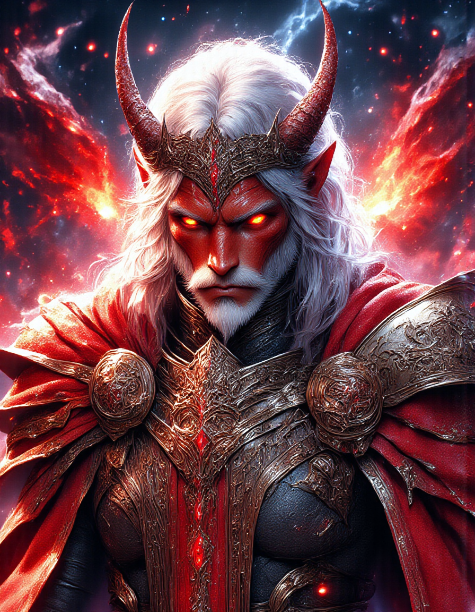

**Name**: Aetherion  
**Class**: Paladin (Oath of Devotion)  
**Race**: Half-Aasimar, Half-Tiefling  
**Deity**: Jazirian, the Eternal Serpent

---

### Early Life  
Born to an aasimar father and a tiefling mother, Aetherion’s very existence seemed a contradiction. His father, a noble aasimar emissary of a celestial court, fell in love with his mother, a tiefling wanderer who had once sought redemption after escaping from a life of crime and dark dealings. Aetherion grew up on the edge of both worlds—the celestial light that graced his father and the infernal shadows that followed his mother.

Torn between these two worlds, Aetherion often felt like he didn’t belong. His golden eyes and faintly glowing skin reflected his celestial heritage, while his horns, tail, and ashen red skin spoke of the infernal blood that coursed through his. This duality made him a target for misunderstanding, fear, and, at times, hatred. The people of his village whispered behind his back, calling him cursed and an omen of chaos.

### The Call of Jazirian
As Aetherion reached adolescence, he found himself increasingly drawn to meditation and reflection. One night, he was visited by a vision of Jazirian, the Eternal Serpent, the deity of balance, knowledge, and cycles. In his vision, Jazirian revealed the perfect union of opposites within him—the celestial and the infernal—and showed him that his unique nature was not a curse but a symbol of balance, the very essence of life and the eternal cycle of existence.

Feeling a sense of purpose he had never known before, Aetherion pledged himself to the ideals of Jazirian. He would become a paladin, upholding the balance between light and darkness, order and chaos, and good and evil. Jazirian’s teachings of harmony and devotion became his guiding star, and Aetherion devoted himself to spreading these teachings.

### Training and Oath  
Aetherion left his home in search of knowledge, studying under clerics and paladins who followed the ways of Jazirian. He honed his martial skills, learning to wield his divine powers with discipline and grace. His divine gifts manifested in subtle ways—his healing touch bore a soft, radiant glow, while his smites carried a faint scent of brimstone. These gifts, both celestial and infernal in nature, marked him as a living embodiment of balance.

When he finally swore his oath of devotion, it was to protect the weak, uphold justice, and preserve harmony in all things. His commitment to his faith was not just about fighting evil, but also understanding and embracing the duality of existence. He vowed to seek redemption for those who walked the darker path while championing the light in all its forms.

### Personality and Motivations  
Aetherion is calm and thoughtful, always seeking to understand both sides of a situation before acting. He believes in the potential for redemption in all beings and has a deep compassion for those who are lost or struggling with inner conflict. His own struggles with identity have made him empathetic and non-judgmental, though he is not naïve—he knows when to stand firm and strike down those who abuse their power or threaten the balance of the world.

His devotion to Jazirian makes him a vigilant protector of balance, but he also recognizes that balance is not about maintaining a constant state of peace. It is about the ebb and flow of cycles—the rise and fall of kingdoms, the birth and death of stars. Aetherion seeks to ensure that neither light nor darkness overwhelms the world, knowing that one cannot exist without the other.

### Flaws  
Despite his calm demeanor, Aetherion sometimes struggles with his own inner turmoil. The infernal side of his bloodline occasionally stirs feelings of anger and doubt, and he fears that he might one day lose control. His dedication to balance also makes his hesitant to fully commit to extreme actions, which can cause his to delay decisions or hesitate in battle when quick action is needed.

### Appearance  
Aetherion is striking, with ash-red skin that carries a faint shimmer of celestial light, as though the stars themselves rest just beneath the surface. His horns curve back elegantly, and his golden eyes seem to glow softly with inner light. He keeps his long silver hair braided, and wears simple but well-crafted armor adorned with the symbol of Jazirian—a serpent biting its own tail, the eternal cycle of life.  

---

Aetherion now journeys the world as a paladin of balance, seeking to guide others toward harmony while keeping watch over the delicate equilibrium between good and evil, law and chaos. His unique heritage and the teachings of Jazirian are both his burden and his greatest strength as he walks the path of a Devotion Paladin.  
