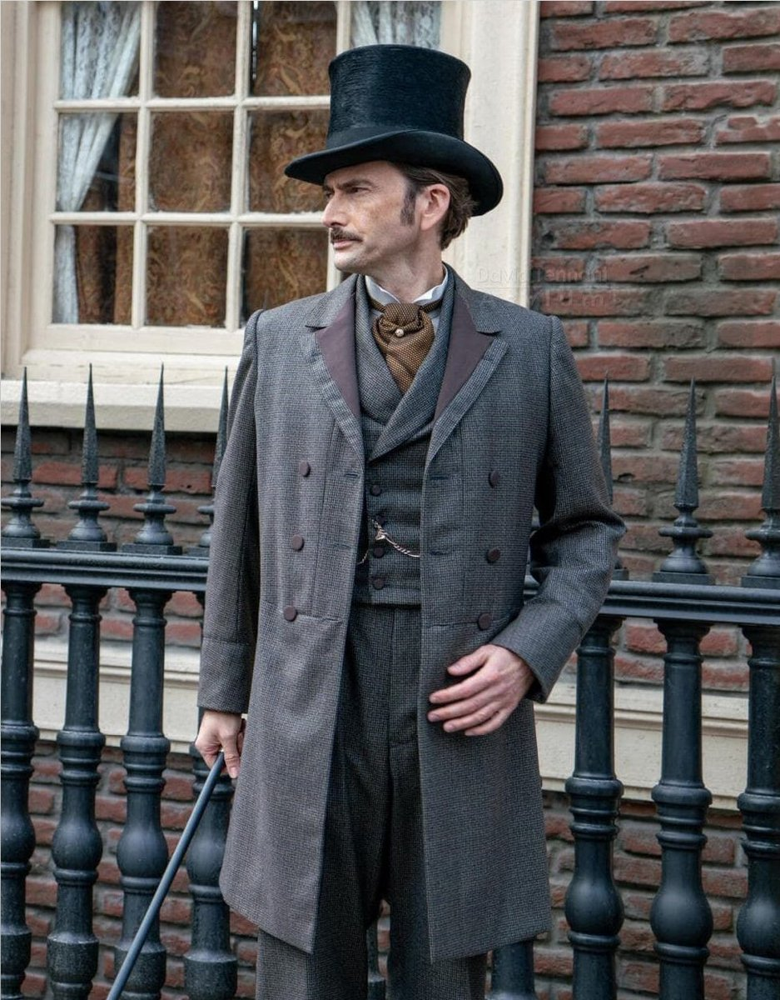

# Angelos Drakos

> 
> ***-Angelos Drakos, the Socialite***

## Character Concept
A scion of a Byzantine noble house that fled Constantinople after it's fall in the year 1453 and moved to Florence. A nobleman by birth that continues the family tradition of researching the occult as member of the Rosicrucians.

## Character Basics

**Full Name:**  Angelos Drakos  
**Race/Ethnic Group:**  Greek  
**Class/Occupation:**  Nobleman occultist  
**Gender:** Male  
**Age:** 48 years old  
**Skin:**  Light tanned  
**Hair:**  Salt and pepper  
**Eyes:**  Blue  
**Distinguishing Marks:**  

**Alignment:**  
**Character Nature:**   

**Personality Traits:**  

* 
  
**Ideals and Goals:**  

* 

**Bonds:**

* 

**Flaws:**

* 

**Virtue:**   
**Vice:**   
**Motto:** 

**Short-Term Goal:**   
**Mid-Term Goal:**   
**Long-Term Goal:**   

**Allies:**
    
* 
  
**Enemies:**

* 
  
**Organizations:**

* 

## Summary

- 

## Backstory
Growing up in the shadow of his family's prestigious history, Angelos was always fascinated by the secrets of the universe and the mysteries of the past. His father, Konstantinos, was a wise and learned man, who had devoted his life to the study of the esoteric sciences. Konstantinos had inherited his knowledge and passion for the occult from his ancestors, who had been members of a Byzantine secret society dedicated to the pursuit of truth and enlightenment.

As a child, Angelos was introduced to the teachings of hermetism, a philosophy that combined the wisdom of the ancient Greeks with the mysticism of the Egyptians. He learned about the four elements, the seven planets, and the twelve signs of the zodiac, as well as the art of alchemy and the principles of sacred geometry. He spent hours in his father's library, reading ancient texts and deciphering cryptic symbols.

When Angelos turned eighteen, he was initiated into the Rosicrucianism secret society, which had been founded by his family in Florence. He took the oath of secrecy and pledged to use his knowledge for the betterment of humanity. He learned about the history of the Rosicrucians, who had been persecuted by the Church and the State for their unorthodox beliefs, and about their mission to spread the light of knowledge and truth.

Angelos soon became one of the most talented members of the society, mastering the art of divination, the science of astrology, and the practice of meditation. He traveled to Egypt and India, seeking the wisdom of the ancient sages, and he met with other members of the society in secret gatherings, where they discussed the latest discoveries and debated the most esoteric topics.

Due to his family's wealth and influence, Angelos Drakos was a cosmopolitan man who lived life to the fullest. He was a great collector of occult books, artifacts, and mementos, and his extensive library was the envy of many scholars. He traveled the world in search of rare and exotic objects, and he was always eager to learn more about the mysteries of the universe.

Angelos was a well-known figure in the learned societies of Europe, and his family was a secret patron of many of them. The Royal Society, the National Geographic, and other esteemed organizations all counted the Drakos family among their supporters. Angelos often attended their meetings and conferences, sharing his knowledge and insights with his peers.

Despite his busy schedule, Angelos always made time for his spiritual practice. He continued to study the teachings of hermetism and the Rosicrucians, and he was always exploring new avenues of mystical inquiry. He had a deep reverence for the wisdom of the ancient sages, and he was always seeking to integrate their teachings into his own life.

Angelos was a bachelor, but he had many friends and acquaintances, both within and outside the occult community. He was known for his generosity and his kind heart, and he often used his wealth and influence to help those in need.

As the world entered the twentieth century, Angelos Drakos remained a beacon of light in a world of darkness and confusion. His dedication to the pursuit of truth and enlightenment was an inspiration to all who knew him, and his legacy lived on long after his death.

## Lore

### House Drakos

-

#### Notable members

- 

