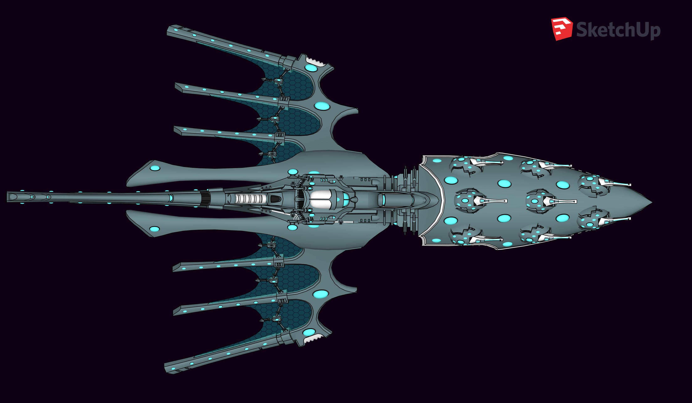
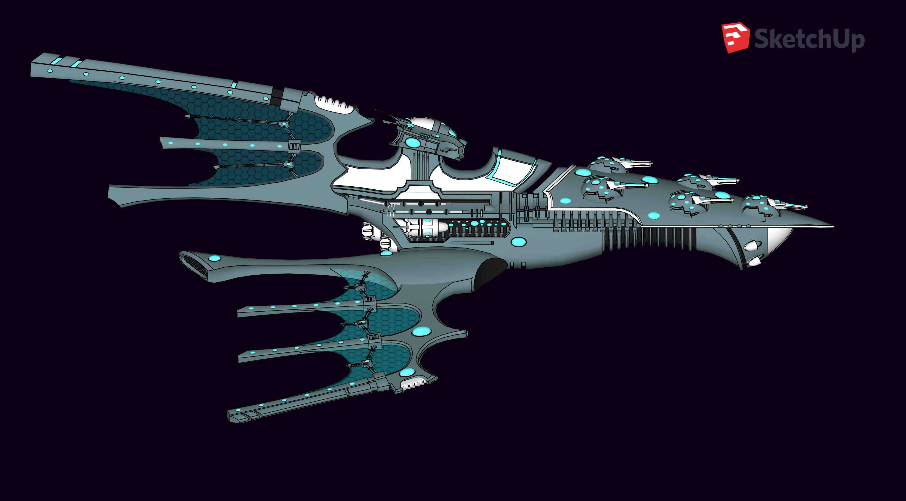

# Aeldari Armoury

## Weapons

### Witchblade
|                                                                           |                                                                               |
|---------------------------------------------------------------------------|-------------------------------------------------------------------------------|
| Martial weapon, melee weapon, major tier, legendary (requires attunement) |                                                                               |
| Priceless, 3 lb.                                                          | 1d8 magical piercing plus 1d8 magical slashing — Finesse, Armor Piercing (-4) |

&nbsp;

*A Witchblade is a psychically-attuned melee weapon that a Craftworld Aeldari walking the Path of the Seer, such as Warlocks and Farseers, often carry to battle.  
Essentially a potent Force Weapon, these swords resonate with their users, enhancing their physical strength to terrifying levels -- Farseers have been known to slash through the heaviest of power armour or cleave battle tanks clean in half with devastating blows from these weapons.  
Used to enhance and unleash the latent psychic power of the wielder, Witchblades are effective against all infantry targets; humanoid, xenos, beast or Daemon.  
A Witch Blade contains a helix-shaped, crystalline psychic matrix embedded with runes to channel and focus a Seer's psychic energies.*

&nbsp;

**Lethal Strike.** When you hit a creature with a melee weapon attack, you can expend psi points, up to your psi limit, to deal psychic damage to the target, in addition to the weapon's damage. The extra damage is 1d10 per psi point spent. The extra damage ignores resistance to phychic damage and treats immunity to psychic damage as resistance to phychic damage.
> Based on the Mystic Psionic Weapon discipline

**Armor Piercing.** Attacks with weapons or ammunition with the armor piercing trait are quite effective against armor, by either burning straight through it or passing through unsealed areas.
* Armor Piercing (-1). Targets with natural armor or worn armor and an AC of 14 or better take a -1 penalty to AC.
* Armor Piercing (-2). Targets with natural armor or worn armor and an AC of 16 or better take a -2 penalty to AC, in addition to the benefits of armor piercing (-1).
* Armor Piercing (-3). Targets with natural armor or worn armor and an AC of 18 or better take a -3 penalty to AC, in addition to the benefits of armor piercing (-1) and (-2).
* Armor Piercing (-4). Targets with natural armor or worn armor and an AC of 20 or better take a -4 penalty to AC, in addition to the benefits of armor piercing (-1), (-2), and (-3).
* Armor Piercing (-5). Targets with natural armor or worn armor and an AC of 22 or better take a -5 penalty to AC, in addition to the benefits of armor piercing (-1), (-2), (-3), and (-4).
The AC penalties do not stack together.

&nbsp;

### Void Sabre
|                                                                           |                                                                               |
|---------------------------------------------------------------------------|-------------------------------------------------------------------------------|
| Martial weapon, melee weapon, major tier, rare |                                                                               |
| Priceless, 3 lb.                                                          | 1d8 magical slashing — Finesse |

&nbsp;

*Void Sabres are archaic weapons seem most frequently among Eldar Corsairs. Crafted from wraithbone interlaced with a rare anathemic crystal found upon Dead Worlds orbiting the edge of the Ghoul Stars, Void Sabres are considered by some within the Eldar race to be accursed. However in many Corsair bands these weapons are considered status symbols.*

When you roll a 20 with this magic weapon, the target takes an extra 7 slashing damage.
> based on the Vicious Weapon

&nbsp;

### Shuriken Pistol
|                                                                                                 |                                                                                                             |
|-------------------------------------------------------------------------------------------------|-------------------------------------------------------------------------------------------------------------|
| Firearm, futuristic, martial weapon, ranged weapon, major tier, legendary |                                                                                                             |
| Priceless, 3 lb.                                                                                | 3d6 magical slashing - Ammunition (150/600), reload (100), armor piercing (-3). |

&nbsp;

*Shuriken Weapons are the primary type of anti-personnel weapons used by the Aeldari. Utilising gravitic pulses, a mono-molecular disc of plasti-crystal taken from the weapon's magazine is accelerated down the barrel of the weapon, hurling it at the target at incredible velocity. The accelerator creates a peristaltic shift from the front to the rear of the firing chamber, hurling the shuriken missiles forward at a tremendous velocity. A burst of several missiles can be fired in a fraction of a second in this way.*

&nbsp;

**Speed dart** When you hit a creature with a ranged weapon attack, you can expend psi points, up to your psi limit, to deal psychic damage to the target, in addition to the weapon's damage. The extra damage is 1d10 per psi point spent. The extra damage ignores resistance to phychic damage and treats immunity to psychic damage as resistance to phychic damage.
> Based on the Mystic Nomadic Arrow discipline

**Ammunition.** You can use a weapon that has the ammunition property to make a ranged attack only if you have ammunition to fire from the weapon. Each time you attack with the weapon, you expend one piece of ammunition. Drawing the ammunition from a quiver, case, or other container is part of the attack. Loading a one-handed weapon requires a free hand. The ammunition of a firearm is destroyed upon use.
If you use a weapon that has the ammunition property to make a melee attack, you treat the weapon as an improvised weapon. A sling must be loaded to deal any damage when used in this way.

**Armor Piercing.** Attacks with weapons or ammunition with the armor piercing trait are quite effective against armor, by either burning straight through it or passing through unsealed areas.
* Armor Piercing (-1). Targets with natural armor or worn armor and an AC of 14 or better take a -1 penalty to AC.
* Armor Piercing (-2). Targets with natural armor or worn armor and an AC of 16 or better take a -2 penalty to AC, in addition to the benefits of armor piercing (-1).
* Armor Piercing (-3). Targets with natural armor or worn armor and an AC of 18 or better take a -3 penalty to AC, in addition to the benefits of armor piercing (-1) and (-2).
* Armor Piercing (-4). Targets with natural armor or worn armor and an AC of 20 or better take a -4 penalty to AC, in addition to the benefits of armor piercing (-1), (-2), and (-3).
* Armor Piercing (-5). Targets with natural armor or worn armor and an AC of 22 or better take a -5 penalty to AC, in addition to the benefits of armor piercing (-1), (-2), (-3), and (-4).
The AC penalties do not stack together.

**Reload.** A limited number of shots can be made with a weapon that has the reload property. A character must then reload it using an action or a bonus action (the character's choice).
Two-Handed. This weapon requires two hands to use. This property is relevant only when you attack with the weapon, not when you simply hold it.

&nbsp;

### Ranger Long Rifle
|                                                                                                 |                                                                                                             |
|-------------------------------------------------------------------------------------------------|-------------------------------------------------------------------------------------------------------------|
| Firearm, futuristic, martial weapon, ranged weapon, major tier, legendary (requires attunement) |                                                                                                             |
| Priceless, 7 lb.                                                                                | 6d8 radiant - Ammunition (2,000/8,000), reload (100), scope (range 8,000), armor piercing (-5), two-handed. |

&nbsp;

*Used by the Rangers, the Long Rifle is an advanced sniper rifle outfitted with top-notch stabilising systems and powerful sights with an integrated target scanning system, allowing the user to pinpoint the weak spots on any enemy.  
While equivalent in function to the Imperial Long-Las, the long rifle is custom-grown to take advantage of the superior abilities of the Eldar, and its psychically-grown firing crystals maintain a tighter beam over longer distances.*

&nbsp;

**Speed dart** When you hit a creature with a ranged weapon attack, you can expend psi points, up to your psi limit, to deal psychic damage to the target, in addition to the weapon's damage. The extra damage is 1d10 per psi point spent. The extra damage ignores resistance to phychic damage and treats immunity to psychic damage as resistance to phychic damage.
> Based on the Mystic Nomadic Arrow discipline

**Pans-pectral scope.** These rifles are equiped with a Pan-spectral scope sight. While looking through the sight, you have truesight, you have advantage on Wisdom (Perception) checks that rely on sight, and in conditions of clear visibility, you can make out details of even extremely distant creatures and objects as small as 2 feet across.

**Ammunition.** You can use a weapon that has the ammunition property to make a ranged attack only if you have ammunition to fire from the weapon. Each time you attack with the weapon, you expend one piece of ammunition. Drawing the ammunition from a quiver, case, or other container is part of the attack. Loading a one-handed weapon requires a free hand. The ammunition of a firearm is destroyed upon use.
If you use a weapon that has the ammunition property to make a melee attack, you treat the weapon as an improvised weapon. A sling must be loaded to deal any damage when used in this way.

**Armor Piercing.** Attacks with weapons or ammunition with the armor piercing trait are quite effective against armor, by either burning straight through it or passing through unsealed areas.
* Armor Piercing (-1). Targets with natural armor or worn armor and an AC of 14 or better take a -1 penalty to AC.
* Armor Piercing (-2). Targets with natural armor or worn armor and an AC of 16 or better take a -2 penalty to AC, in addition to the benefits of armor piercing (-1).
* Armor Piercing (-3). Targets with natural armor or worn armor and an AC of 18 or better take a -3 penalty to AC, in addition to the benefits of armor piercing (-1) and (-2).
* Armor Piercing (-4). Targets with natural armor or worn armor and an AC of 20 or better take a -4 penalty to AC, in addition to the benefits of armor piercing (-1), (-2), and (-3).
* Armor Piercing (-5). Targets with natural armor or worn armor and an AC of 22 or better take a -5 penalty to AC, in addition to the benefits of armor piercing (-1), (-2), (-3), and (-4).
The AC penalties do not stack together.

**Scope.** Firearms with the scope trait have a scope which facilitates extreme long-range engagements. If you have not moved since the end of your last turn, you can use an action to aim down the scope of a firearm that has this trait at a specific target. Once you do so, you are incapacitated and your speed becomes 0 until the start of your next turn. However, the first attack you make against the target at the start of your next turn is made as if the firearm has a different range value (listed in parentheses), with no long range at which attacking imposes disadvantage on your attack roll.

**Reload.** A limited number of shots can be made with a weapon that has the reload property. A character must then reload it using an action or a bonus action (the character's choice).
Two-Handed. This weapon requires two hands to use. This property is relevant only when you attack with the weapon, not when you simply hold it.

&nbsp;

## Armor

### Rune Armour
|                                                                                                 |                                                                                                             |
|-------------------------------------------------------------------------------------------------|-------------------------------------------------------------------------------------------------------------|
|Armor (medium or heavy), legacy (requires attunement) |                                                                                                             |

&nbsp;

*Rune Armour is a protective wraithbone armour suit psychically moulded to its Eldar recipient. It provides greater protection than other, bulkier forms of armour, in part because its psychic energy can deflect a shot or blast before it hits the armour. Even lascannons and Plasma Weapons can be turned aside by Rune Armour. Rune Armour is worn only by Farseers and Warlocks*

This armor is fashioned from premium materials that are resilient to being damaged. While wearing this armor, any critical hit against you becomes a normal hit.  

**Superior.** You have a +1 bonus to AC while wearing this armor.  

**Master.** When the armor reaches this grade, it gains the following properties.
* The bonus to AC increases to +2.
* Bludgeoning, piercing, and slashing damage that you take from nonmagical weapon attacks is reduced by 3. This feature is cumulative with the similar benefit gained from the Heavy Armor Master feat.

**Epic.** When the armor reaches its epic grade, it gains the following properties.
* The bonus to AC increases to +3.
* While wearing this armor, you have resistance to bludgeoning, piercing, and slashing damage from nonmagical attacks.

> Legacy items become `Superior` at level 5, `Master` at level 10, and `Epic` at level 15.

&nbsp;

### Shimmershield
|                                                                                                 |                                                                                                             |
|-------------------------------------------------------------------------------------------------|-------------------------------------------------------------------------------------------------------------|
| Wondrous Item, futuristic, major tier, legendary |                                                                                                             |
| Priceless, 1 lb.                                                                                |  |

*A Shimmershield is a piece of Eldar battle equipment used primarily by Exarchs of the Dire Avenger warrior aspect. It has also been reported to be used by Eldar Corsair Princes, Voidstorm Squads and Void Dreamers. It is an advanced force-field generator that is strong enough to protect the Exarch and the Dire Avengers around him from melee attacks.*

&nbsp;

When active (a bonus action) this device emits a forcefield around the wearer. Whenever the wearer would take damage, the forcefield is damaged first. The forcefield has 30 hit points and regenerates 1 hit point each round. When a forcefield is reduced to 0 hit points, the void shield breaks and requires a DC 20 Intelligence (Technology) check and 1 minute of work to repair. Deactivating a void shield is a reaction.

&nbsp;

### Ghost Helm

&nbsp;

*The Ghost Helm (or Ghosthelm) is a helmet worn by Eldar Farseers. It incorporates intricate crystalline psychic circuitry which helps to mask the wearer's soul or spirit in the warp, protecting them from the depredations of Daemons and other warp creatures.*

> I envision a HUD interface projected in the crystals that act as eyeslots, with information like time, compass, tactical map, tactical enemy information, magnification/zoom, etc., Ironman style. So I plan to combine items like the `Eyes of the Eagle`, the `Eyes of Minute Seeing`, an `Orb of Direction`, an `Orb of Time`, an `Obviator's Lenses`, the `Goggles of Night`, the `Goggles of Object Reading`, a `Danoth's Visor`, a `Dorje of Assess Foe`, etc. This can be an ongoing project, with me adding more and more functionality as we go along.

&nbsp;

## Equipment

### Tears of Isha

&nbsp;

*Spirit Stones are made out of psycho-receptive crystals called waystones. At the moment of the Eldar's death, the stone acts like a 'psychic trap', absorbing their psychic self and preventing it from entering the warp and being consumed by the nemesis of the Eldar race: Slaanesh. The Waystone can then be brought back to the Eldar's own Craftworld and embedded into its wraithbone core where it will grow into a larger spirit stone. Once the stone is implanted, the Eldar's soul can travel freely through the wraithbone, mingling with other Eldar souls and forming part of the communal spirit of the Craftworld itself. All the souls within a Craftworld collectively exist inside the Infinity Circuit. In times of dire need, the Eldar are also able to retrieve the spirit stones of long dead Eldar heroes and place them into the artificial bodies of Wraithguards and Wraithlords. These constructs are then piloted by the Eldar soul, which experiences reality as a dream. This process is considered necromancy in Eldar culture and is only used as a last resort. The Eldar Warlocks who specialize in this process are known as Spiritseers. Iyanden, an Eldar Craftworld with a very small population is known for its greater use of these 'living dead'.*

> As we have discussed, I would like to improve this during our travels from a `Ring of Mind Shielding`, adding an `Amulet of Proof against Detection and Location`, the `Charm against charming` we just got, and finally a `Mind Blank` enchantment.

&nbsp;

## Vehicle

### Aurora class Light Cruiser "Arcadia"

#### Info:
https://wh40k.lexicanum.com/wiki/Aurora_Light_Cruiser  
https://forums.focus-home.com/topic/384/ship-profiles/20
