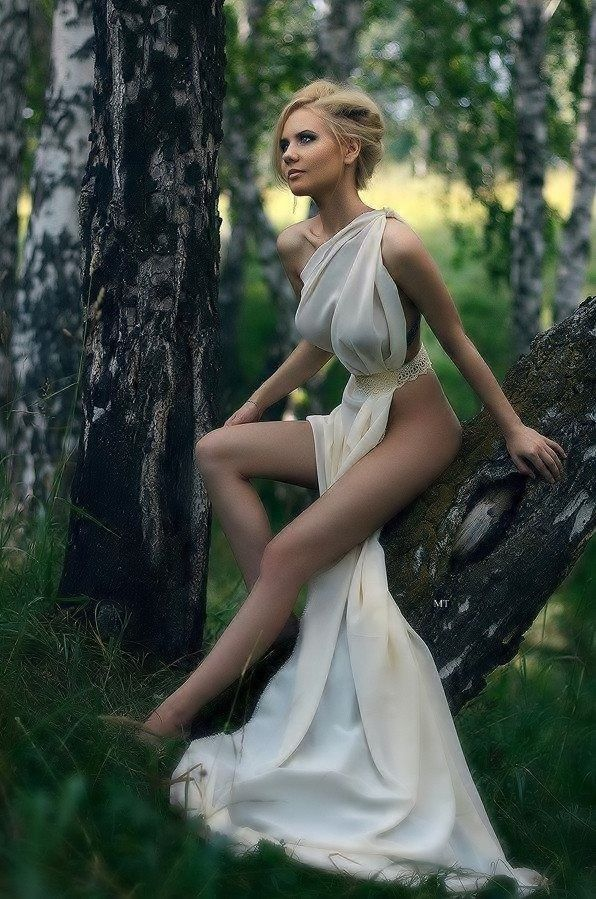
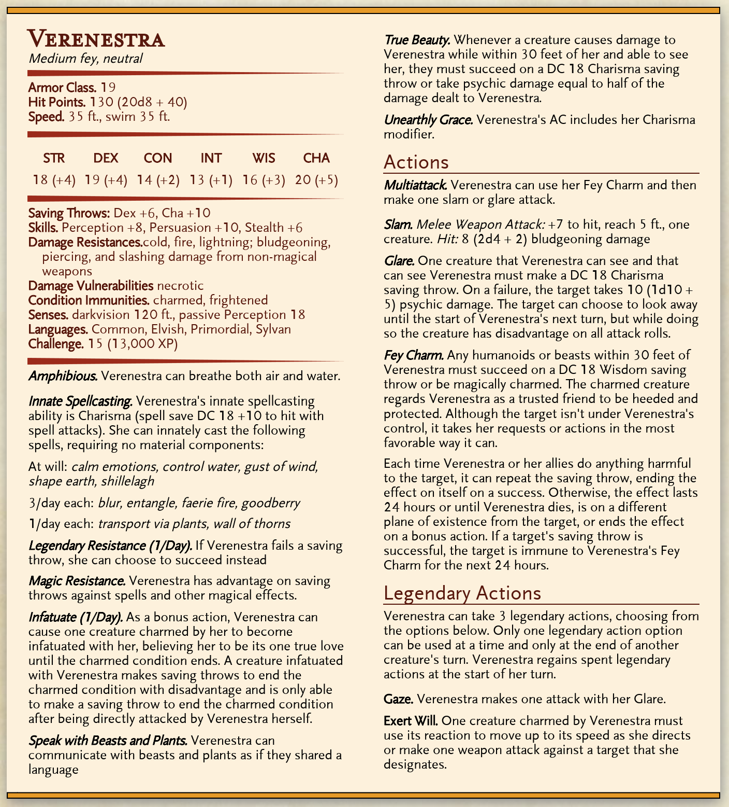

## Fey Morality

I chose three popular Fae tropes, and analyzed them in order to create a bit of a moral system. The tropes I chose were:

* Fierce guardians of Fairy Forts, usually described as natural places.
* Stealing children and replacing them with Changeling Duplicates
* Apparently arbitrary changes of allegiance or attitude, betraying centuries old alliances on a whim, or siding with old enemies without a second thought.

From these I decided Fairies had the following qualities:

* Fierce guardianship of Nature.
* A sense of fairness that doesn't need to be agreed upon by both parties
* Love of Spontaneity.

Which when translated into moral statements looked a little something like this:

* We are simply another part of nature, to do anything but accept your place on the food chain is heinous.
* All deals and trades must be equal.
* It is best and greatest to do that which is dramatic for the moment, to stick to a plan or side even when it becomes uninteresting is heinous.

## Fey Traits/Weaknesses
* **Beauty above all else** - Fae creatures adore beautiful things. This doesn't mean your character would have high standards but on the contrary might have a deep love for something incredibly strange that they find beautiful. A certain pitch of note or specific way of drawing (even if they abhor the art itself) maybe even something typically considered ugly in the material plane but is loved in circles back home.
* **Weakness to Iron** - This is a big one that I generally recommend changing. Fae in almost all Celtic myth are weak to Iron, or cannot pass over it. I'd recommend changing this to a special type of Iron in your game, perhaps one that's difficult to get. Otherwise, the party is going to be walking around essentially carrying Fae kryptonite all of the time.
* **Inability to tell a direct lie** - This one's fun. Fae cannot directly lie. This does not mean, in any way, they have to tell the truth though. They are almost as famous as Djinn or Devils for twisting words, telling half-truths, or bending interpretation.
* **Dealmakers** - Oh yes. The Fae are fond of deals with humans. Usually ones that human thinks is beneficial to them, but actually winds up only benefiting the Fae do to a trick of wording. These deals are usually magically bound, and hell will be wreaked upon the human that doesn't uphold their end.
* **Your word is your bond** - Typically promises and favors are practically Fae currency. Because they often can't lie they will honey their words to make a promise be made to them that works in their favor. Fae aren't devils though and their promises aren't ironclad dispositions with no loopholes. In fact most Fae will intentionally work in loopholes to work in their favor if they have to promise something in a comprised position.  
Your character doesn't have to be intensely clever with wordplay but would probably hold people to their word very strongly and be wary of those who don't make good on their promises. They would also perhaps be reluctant to make a promise they are certain they can't keep.
* **True Name** - Here's one pretty unique to Fairies. In a lot of the old tales, Fae have a common name, and a True Name. Learning/Invoking the True Name will summon the fairy to you, and usually bind it to your will. This could make a fun sidequest, or just a way to set up a Patronship.
* **Must be Invited** - In the really Old Tales, Fae were like Vampires, they actually had to be invited in.
* **Curious** - In many, many tales, the Fae aren't actually malevolent towards humanity, so much as they are fascinated/confused by them. They want to know how humans work, and have their own methods of getting about figuring it out.
* **The passage of time makes no sense** - Faerie is in a constant state of twilight. Even in the Gloaming court night isn't a thing any more than day is and while you don't stop aging in Faerie you might curry the favor of an Archfey and get to stick around if they like you enough. Your character might not have a good sense of how hours and years work in a typical sense.

## Fey Customs

### Basic "Rules" of Fairy
* Every rule has an exception.
* Everything has a cost.
* Perception can be reality.
* Never give what you can't afford to lose, including your name.
* Look for traps behind every word.
* If it looks safe it probably isn't.
* Beauty is a poison that cannot be cured.

### Etiquette 
* Don't accept a gift from the fey.
* Don't consume the food or drink of the Feywild.
* Never dance with a fey.
* Never tell a fey your full name.
* Never stray from a path in the Feywild.
* Use your manners, but don't say "thank you" (or you owe them)
* Don't give a Fey (cheap) clothing
* Always keep your word.
* Don't repay more than you borrowed.

## The Summer Court
The members of the Inner Circle are:
* Queen [Titania](https://forgottenrealms.fandom.com/wiki/Titania), the Summer Queen of the Feywild, leader of the Summer Fey, and possibly the mightiest of all archfey. She is also known as the Faerie Queen and the Queen of Light and leads the Seelie Court.
* King [Oberon](https://forgottenrealms.fandom.com/wiki/Oberon) called the Lord of Beasts or sometimes King Oberon, is a member of the Seelie Court worshiped as a deity of the wilderness and animals. He is at other times known as Oran, and under that name is called the Green Lord.
* [Damh](https://forgottenrealms.fandom.com/wiki/Hyrsam), also called Hyrsam, the Prince of Fools, isthe son of Titania and Oberon. He is the patron of satyrs, korreds, and atomies.
* [Eachthighern](https://forgottenrealms.fandom.com/wiki/Eachthighern), lord of unicorns and pegasi.
* [Sqeulaiche](https://forgottenrealms.fandom.com/wiki/Sqeulaiche), or Squelaiche, is the Court Jester of Queen Titania's Seelie Court and a member of her Inner Circle. Though he is a known ally of at least one deity of the Realms, it is unknown if he is directly worshiped on Toril.
* [Verenestra](https://forgottenrealms.fandom.com/wiki/Verenestra), the daughter of Titania and patroness of dryads, nymphs, and sylphs.

The members of the Outer Circle are:
* [Caoimhin](https://forgottenrealms.fandom.com/wiki/Caoimhin), the small and shy patron god of the killmoulis.
* [Emmantiensien](https://forgottenrealms.fandom.com/wiki/Emmantiensien), the patron god of treants and a member of the Outer Circle of Queen Titania's Seelie Court, acting as the court sage. The name is in fact a contraction of a much longer Treantish name, which translated to "one who is slow to rouse but is great in might when stirred to action".
* [Fionnghuala](https://forgottenrealms.fandom.com/wiki/Fionnghuala), the patron goddess of the swanmays.
* [Nathair Sgiathach](https://forgottenrealms.fandom.com/wiki/Nathair_Sgiathach), the mischief-loving god the faerie dragons and pseudodragons.
* [Skerrit](https://forgottenrealms.fandom.com/wiki/Skerrit)t, also known as the Forest Walker, is the neutral good god of the centaurs and satyrs as well as the hunter and protector of the sylvan lands. He watches over the woodland communities and always aspired to maintain the natural balance.

---

## Verenestra the Oak Princess
The daughter of Titania and Oberon and rumored to be the very first nymph, Verenestra is the embodiment of all that is beautiful in nature. Whether she relaxes in a bower of silver birches in a magnificent forest, in a secluded tide pool in a gentle cove, or a peaceful mountaintop overlooking a spectacular view, Verenestra is infallibly beautiful. However, her favorite place to stay is in her mother's realm.
### Sources
* [Monster Mythology](DMGR4%20-%20Monster%20Mythology.pdf) by Carl Sargent
* [Lords and Ladies](Ned%20Turner%20-%20Lords%20and%20Ladies.pdf) by Ned Turner
* [Monster Mythology Update](http://blog.aulddragon.com/2021/01/verenestra-the-oak-princess/)
* [The Forgotten Realms Wiki](https://forgottenrealms.fandom.com/wiki/Verenestra)
### Description
Verenestra's beauty is unmatched by any mortal creature, and those that see her are almost certainly doomed to love her without end. Even those that dare to attack her will find their very minds rebelling against them, crying out in agony at the sin of harming something so perfect and beautiful. Though not outright cruel, Verenestra cares little for those that love her beyond their adoration, and though she frequently takes lovers, she tires of them quickly.  
Verenestra could choose to appear as a demure, slim female nymph, dryad, or sylph. She was always barefooted, wearing only gossamer garments the size of handkerchiefs to provide her with a semblance of modesty.

### Personality
Fickle and vain, Verenestra (VAIR-en-ess-trah) the Oak Princess embodies the unearthly beauty that many female faeries possess. She represents the power such beings have over males of many species, and has adopted as her charges the dryads, nymphs, and sylphs that so often exercise such influence. She is flighty and follows the whims of her emotions, but she is also deeply sensitive and caring towards her charges.
### Origin
Child of Titania and inheritor of her beauty, Verenestra is sometimes said to have no father but the wind that blows through the tree boughs of the Seelie Court. More often she is seen as daughter of Titania and Oberon, while some few try to reconcile these two tales into one. As with her brother Damh, the Oak Princess has adopted a number of faerie creatures as her charges, particularly those that share her eternally youthful appearance and demeanor. While her motives for taking on her charges were in part similar to Damh's desire to reduce the burden their mother had taken upon herself, Verenestra's myths portray her decision as one made out of recognition that female faeries often face greater and more diverse threats than other sylvan creatures. These same myths describe her adoption of the dryads, nymphs, and sylphs as having infused them with eternal beauty that could serve as a weapon in itself, supplemented by additional magical gifts.
### Tales and Myths
Outside of her origin myths, faerie stories about the Oak Princess are rarely adventuresome tales; some are moral tales that have her learn valuable lessons after getting embroiled in trouble due to her vanity or haughtiness, while others revolve around pursuit of her affections by a variety of overly-amorous suitors. Tales in the first category portray her personality as one of compassion and good nature, but struggling with vanity, flighty rashness, and fits of jealousy, but her actions never intentionally inflict harm. Most of these tales involve mortals, but the most prominent feature other deities, such as Eshebala, who try to trick or lure her by exploiting her weaknesses in order to undermine the Seelie Court. Some sorrowful tales relate the origins of fallen or corrupted faerie folk, such as unseelie nymphs, through the manipulation of Verenestra and her faults by the likes of Cegilune or the Queen of Air and Darkness. Other tales are purely comedic, designed to delight and teach listeners life lessons. The second category of tales are nearly universally comedic, although some have darker undertones about the dangers outsiders pose to faerie folk. In these stories, the Oak Princess leads amorous males and deities of other pantheons on merry chases in order to dissuade them from their desires. Such tales may include many other deities and creatures on both sides of the chase, or they may include none at all. In the end, the amorous male usually has their ardor cooled enough to call off the chase, with a few ending somewhat differently. A handful of tales end with Verenstra, feeling flattered by her pursuer’s skill and tenacity, allowing herself to be caught for a night of passion. In no tale is she ever caught against her will, but that is not to say all of her suitors appreciate her antics; some deities she has evaded in these tales are said to have turned their disappointment into anger or hatred, and sworn revenge upon her.
### Relations
Verenestra's relations with other deities are often dependent on her personality. She is vain and not a little bit jealous of other goddesses of beauty; she snobbishly spurns the company of deities such as Aphrodite and Sune. The exception is her strong friendship with the elven goddess Hanali Celanil; this is a relatively recent development due to Lady Goldheart's concerted effort coupled with her tender kindness and love of life. By contrast, it has been said that the Oak Princess has had more than one dalliance with Baldur, the Aesir god of beauty, as well as various other beauteous male deities. She is also strongly allied with a variety of nature powers, although only with Rillifane Rallathil is she regularly romantically linked. Baervan Wildwanderer has long made his romantic interest in the Oak Princess known, but as yet she has not returned his feelings, although the two remain friends and allies.
### On the Prime Material
Verenestra rarely visits the Prime Material Plane on her own, only doing so to visit with particularly wise and old nymphs, dryads, or sylphs, or to entice particularly handsome and charismatic males into short-term dalliances, after which she may reward them with a modest magical item from the Seelie Court. Otherwise, she only accompanies another sylvan power on missions of import and communal interest, such as protecting ancient sylvan lands and the faeries who dwell therein.
### 

---

## Further Reading and Sources
### Links
* **Blue/Orange morality:** [Part 2: The Fae](https://www.reddit.com/r/DnDBehindTheScreen/comments/383xim/blueorange_morality_and_rpgs_thoughts_on_the/), [Part 2.5: Implementing the Fae in game: Patron](https://www.reddit.com/r/DnD/comments/38aaor/blueorange_morality_in_rpgs_part_25_implementing/)
* **Fey Etiquette and Laws of Hospitality:** [Thread 1](https://www.reddit.com/r/dndnext/comments/7xkzm8/fey_etiquette/), [Thread 2](https://www.reddit.com/r/dndnext/comments/hdjtdl/if_someone_was_bound_by_fey_laws_of_hospitality/), [Thread 3](https://www.dndbeyond.com/forums/d-d-beyond-general/story-lore/42817-true-fey-etiquette)
* **Feywild:** [A Guide to the Feywild](https://docs.google.com/document/d/1N1W_v8kBnukfUxSEkGDAjQ6_rSzlBCtMt1Hs2PlIc6w/edit)
* **Verenestra the Oak Princess:** [The Forgotten Realms Wiki](https://forgottenrealms.fandom.com/wiki/Verenestra), [Monster Mythology Update](http://blog.aulddragon.com/2021/01/verenestra-the-oak-princess/)
* **Warlock Patron Variant:** [The Fey Highlord Patron](https://www.tribality.com/2017/09/07/the-fey-highlord-patron/)
* **Fluff:** [Treasures of the Fey-Market](https://www.tribality.com/2016/05/19/treasures-of-the-fey-market/)

### Bibliography
* [Faeries](Faeris.pdf) by Brian Fround and Alan Lee
* [Journey into the Faywild](Journey%20Into%20the%20Feywild.pdf) by Jacky Leung
* [Gimble's Guide to the Feywild](Gimble's%20Guide%20to%20the%20Feywild.pdf) by David Markiwsky
* [The Book of the Fey A Fey Bestiary](Pirate%20Gonzalez%20-%20The%20Book%20of%20the%20Fey%20A%20Fey%20Bestiary.pdf) by Pirate Gonzalez
* [Monster Mythology](DMGR4%20-%20Monster%20Mythology.pdf) by Carl Sargent
* [Lords and Ladies](Ned%20Turner%20-%20Lords%20and%20Ladies.pdf) by Ned Turner
* [Fey Compendium I: Spirits Of The Feywild]([Ned%20Turner]%20Fey%20Compendium%20I%20Spirits%20Of%20The%20Feywild%20[Screen][OEF][14-07-2020].pdf) by Ned Turner