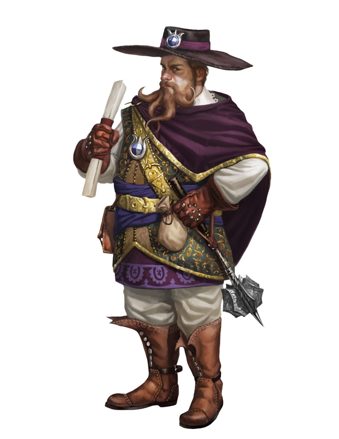
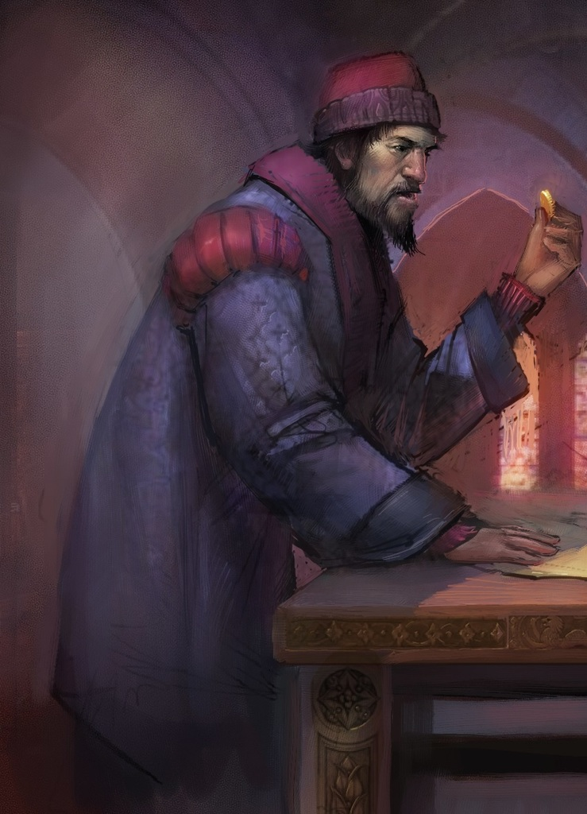
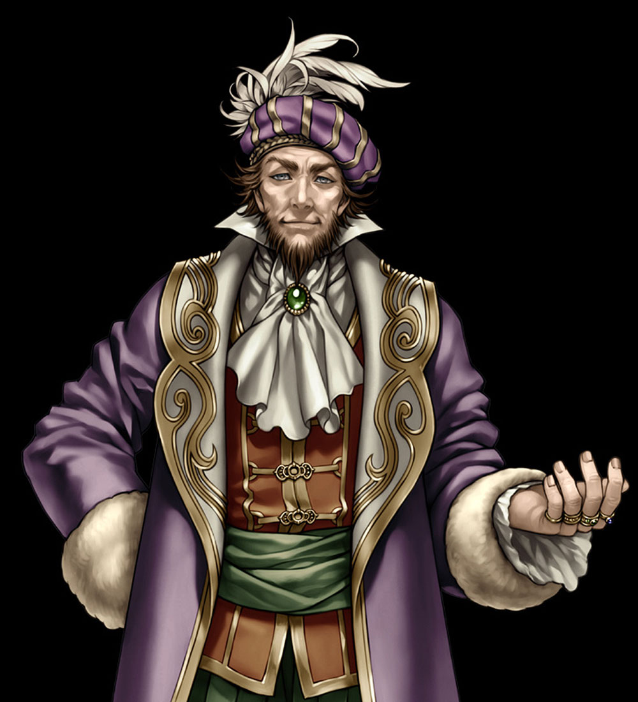
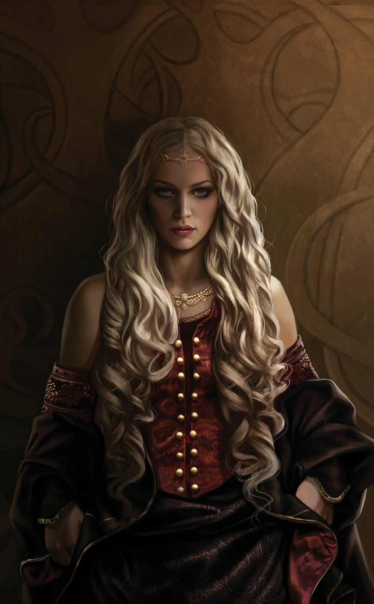
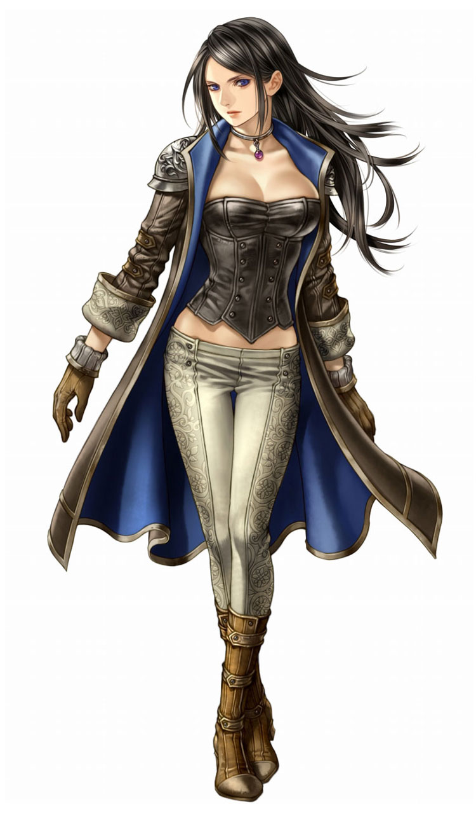
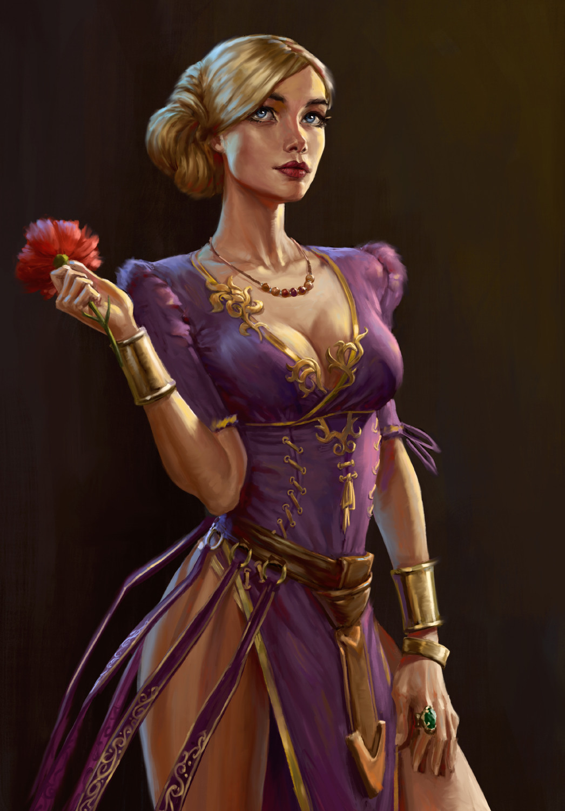

## Summary
* Illegitimate son of Ortwin Kolmar, a wealthy textiles merchant, and Lolafiel Rêve, an elven courtesan.
* His father is not aware of his true identity.
* He was raised among the courtesans until his mother became the mistress of constable Benoît Marcel Gaumont, who introduced his mother and him to the court.
* He served as a page to constable Gaumont, but due to him being lowborn he never got the chance to become an esquire.
* At the age of 16 he officially became a clerk of the Crown, mostly as a messenger. His charms and wit though quickly turned him into a confidante and a deal broker.
* At the age of 20, his looks and charms got the attention of Lady Eleanor Thond. Their romance catapulted his career, with him carrying more and more significant missions.
* He has his eyes on Princess Raedra, but knows that he needs more than his best game to win her over.
* He despises his true father, but understands the power of information. Still, he wants to see him fall from grace and drugged through the mud.
* On his last diplomatic mission to Calimport, he went missing. (Probably his real father finally caught up with his identity and sold him into slavery).

## People of Interest
* **Lolafiel Rêve** (his mother): An immigrant from, the now destructed, Cormanthor, the priestess of Sune (Lust domain Cleric) settled down on Suzail almost 100 years ago.

  
  
  
  

* **Constable Benoît Marcel Gaumont** (Guardian): 

* **Ortwin Kolmar** (Biological father): This textiles merchant has grown wealthy selling his wares to the people of Akanûl, the Sword Coast, and the Moonsea. However, he stands to make himself even wealthier by reinvesting those mercantile profits in the true coin of the court: information. Kolmar holds secrets pertaining to nearly every field of trade or endeavor, and he is happy to arrange spying work for any capable characters willing to get their hands dirty. Though some people swear by Ortwin's usefulness, others avoid him for the disrepute that clings to him. Whatever business Ortwin Kolmar is involved in, chances are good that it breaks the law or borders on the treasonous.  
For his own part, Kolmar sees himself not as a traitor to the realm but as a true entrepreneur, brokering deals among nobles and courtiers at a modest price. An inveterate coward with little stomach for battle, Kolmar faints at the sight of his own blood (use the human lackey from the Monster Manual for his statistics). When not at court with the Purple Dragons to guard him, he maintains a small army of mercenaries to defend against attack.  

  
  

* **Princess Raedra** (Romance mark): Not yet twenty, Princess Raedra Obarskyr is a figure of great interest to noble houses across Cormyr. The second child of Crown Prince Irvel and Princess Ospra, she is the first daughter born to House Obarskyr in more than a century. A woman of great beauty, she is said to possess the intellect of Tanalasta, the charm of Filfaeril, the strategy of Alusair, the temper of Gantharla, first Queen of Cormyr, and the sword-arm of Enchara the warrior queen. (The last is not strictly true, since Raedra prefers the rapier to heavier blades when training.)  
The princess has already refused more than a dozen proposals of marriage or betrothal from courtiers both Cormyrian and foreign, most rejected with only a moment's thought. When pressed, she responds that she is not a prize for some noble or adventurer to win. She is a princess of Cormyr, in whom the royal lines of Esparin, Tethyr, and ancient Athalantar are joined. As such, she vows to wed only a husband worthy of her station, if not of her genuine love.

  

* **Lady Eleanor Thond** (high-places contact and occasional lover), a female human bard, is a beautiful and intelligent courtier with an eye for detail. She comes from a merchant family outside Arabel and is intensely ambitious. Through diplomatic skill, unrelenting drive, and more than a little luck (she is a devout follower of Tymora), Thond rose through the ranks of the courtiers and was named Morahan's herald, which gave her a noble's rank. She has the subtle touch that Lord Morahan lacks, and she often follows in his wake, smoothing over matters. Unmarried, she has a soft spot for dashing young men and loves the ideals of courtly romance. Thond hopes to marry into one of the great noble houses in Cormyr one day. She would consider undermining Morahan's hold on his position as Lord Magister in return for joining a noble house. However, she genuinely likes Morahan, and she would not desert him unless the offer was too good to refuse.	

  

* **Penelope Nilain** (his mother's protege and his childhood friend) is a courtesan renowned throughout the city for her wit, beauty, and physical talent. She has escorted many nobles over the years, and her companionship is always in demand. Nilain recently decided to retire from the business. To support herself in retirement, she is writing her autobiography, which is sure to contain salacious details on a large number of nobles. She is offering her former clients the opportunity to buy their way out of being mentioned in her book. She hires the party to protect her from any accidents that might befall her during the writing process. On the other hand, parts of her autobiography must be juicy indeed if nobles are willing to spend significant gold to prevent themselves from being included. Those pages would be extremely valuable in the right hands. Anyone who steals her manuscript can name his own price—or he might become the new target.

  