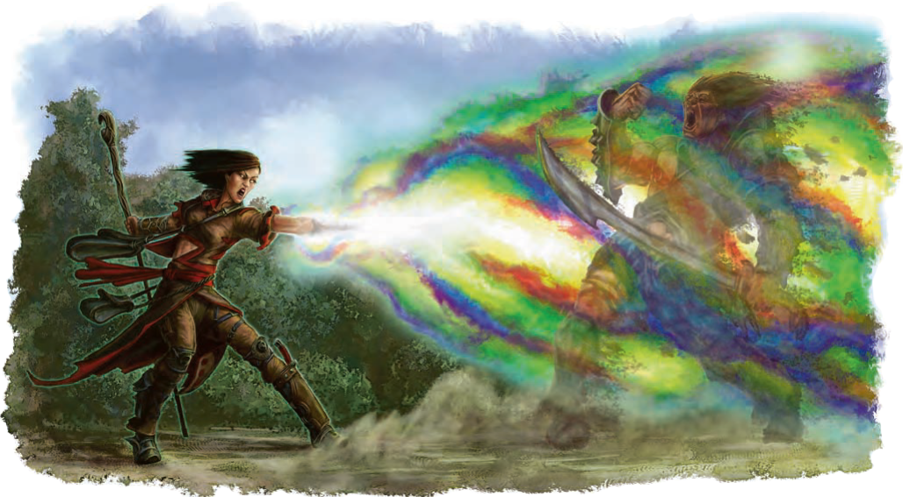

# Selanar — Spell Reskins & One New Spell (for approval)

The goal behind all of these: give Selanar a consistent **iridescent / kaleidoscopic / prismatic light** identity — I'm reclaiming the rainbow. Three of the four are pure reskins of existing spells (mechanics untouched except where explicitly flagged); the fourth is a new spell, presented with full damage-comparison receipts so you can judge it in one look. Each item stands alone — approve, tweak, or veto them independently.

---

## At a glance — the three reskins

| Original | Becomes | What actually changes |
|---|---|---|
| Green-Flame Blade | **Spellfire Blade** | Damage type **fire → radiant**, matching published spellfire — every spellfire effect in print (*Spellfire Spark*, *Spellfire Adept*, *Spellfire Flare*, all in the 2025 FR player book) deals radiant. Everything else identical. *(Honest flag: radiant is resisted less often than fire — happy for it to count as fire against resistances if preferred.)* |
| Booming Blade | **Echoing Light Blade** | Damage type **thunder → radiant**. Everything else identical — the rider still punishes willing movement. |
| Shadow Blade | **Iridescent Blade** | Damage type **psychic → radiant**; the conditional advantage flips **dim light/darkness → bright light from an external source** (the blade's own glow never counts — the light has to refract into it from elsewhere). New built-in cost: the blade **coalesces from the light around it** — casting it snuffs a torch, wanes a campfire to embers, or ends a minor light spell nearby, and it can't be cast in total darkness at all. |

Why "spellfire": Green-Flame Blade has next to zero lore behind its green fire, while spellfire — raw Weave-stuff, Mystra's own — has a ton, and it's already the heart of this character's story (Spellfire Spark origin feat, the birth-night backstory beat).

---

### Spellfire Blade
*Evocation cantrip · 1 action · Self (5-foot radius) · S, M (a melee weapon worth at least 1 sp) · Instantaneous*

You channel raw arcane power into the weapon used in the spell's casting and make a melee attack with it against one creature within 5 feet of you. On a hit, the target suffers the weapon's normal effects, and you can cause an arc of crackling, azure spellfire to leap from the target to a different creature of your choice that you can see within 5 feet of it. The second creature takes radiant damage equal to your spellcasting ability modifier.

This spell's damage increases when you reach higher levels. At 5th level, the melee attack deals an extra 1d8 radiant damage to the target on a hit, and the radiant damage to the second creature increases to 1d8 + your spellcasting ability modifier. Both damage rolls increase by 1d8 at 11th level (2d8 and 2d8 + modifier) and again at 17th level (3d8 and 3d8 + modifier).

---

### Echoing Light Blade
*Evocation cantrip · 1 action · Self (5-foot radius) · S, M (a melee weapon worth at least 1 sp) · 1 round*

You brandish the weapon used in the spell's casting and make a melee attack with it against one creature within 5 feet of you. On a hit, the target suffers the weapon's normal effects and becomes wreathed in shimmering, prismatic after-images until the start of your next turn. If the target willingly moves 5 feet or more before then, the after-images collapse into a blinding flash, dealing 1d8 radiant damage to the target, and the spell ends.

This spell's damage increases when you reach higher levels. At 5th level, the melee attack deals an extra 1d8 radiant damage to the target on a hit, and the damage the target takes for moving increases to 2d8. Both damage rolls increase by 1d8 at 11th level (2d8 and 3d8) and again at 17th level (3d8 and 4d8).

---

### Iridescent Blade
*2nd-level illusion · 1 bonus action · Self · V, S · Concentration, up to 1 minute*

You weave together threads of pure, scintillating light to create a sword of solidified brilliance in your hand. The blade is not conjured from nothing — it must **coalesce from the light around you**. When you cast the spell, one source of illumination of your choice within 30 feet is drawn into the blade: a nonmagical flame is extinguished or dwindles (a torch snuffs out, a lantern gutters, a campfire wanes to embers), or a light created by a spell of 2nd level or lower (such as *Light*) flickers out. If the only illumination is ambient and inexhaustible (daylight, a mythal's glow), nothing is consumed — there is light to spare. **The spell cannot be cast in an area of total darkness.**

This magic sword lasts until the spell ends. It counts as a simple melee weapon with which you are proficient. It deals 2d8 radiant damage on a hit and has the finesse, light, and thrown properties (range 20/60). The blade itself sheds only dim light in a 5-foot radius — the stolen light, held in tension.

In addition, when you use the sword to attack a target that is in bright light **from a source other than the blade itself**, the surrounding light refracts and reflects through the blade in a distracting, kaleidoscopic flare. You make the attack roll with advantage. The blade's own glow never enables this — the effect exists only where external light can be caught and bent.

If you drop the weapon or throw it, it refracts into nothingness at the end of the turn. Thereafter, while the spell persists, you can use a bonus action to cause the sword to reform in your hand, coalescing from the ambient light.

**At Higher Levels.** When you cast this spell using a 3rd- or 4th-level spell slot, the damage increases to 3d8. When you cast it using a 5th- or 6th-level spell slot, the damage increases to 4d8. When you cast it using a spell slot of 7th level or higher, the damage increases to 5d8.

---

## Rainbow Blast — new spell

*3rd-level evocation · 1 action · Self (120-foot line) · V, S, M (a small clear gem or crystal prism worth at least 50 gp) · Instantaneous*

From your splayed fingers shoots a 120-foot-long, 5-foot-wide blast of mixed energy and multihued lights. The blast burns and freezes, sizzles and screams.

This spell is a wide-spectrum blast of radiant energy composed of seven energy types. Each creature in the line must make a Dexterity saving throw. A creature takes **1d6 damage of each of the seven energy types** (fire, acid, lightning, poison, cold, thunder, force) — **7d6 total** — on a failed save, or half as much damage on a successful one.

**At Higher Levels.** When you cast this spell using a 4th-level spell slot, the damage dice become d8s (7d8). With a 5th-level slot, d10s (7d10). With a 6th-level slot, d12s (7d12). **The spell does not grow stronger beyond a 6th-level slot** — a 7th-, 8th-, or 9th-level casting deals 7d12.

### Design notes — why I think this is fair

- **Always seven dice, one per color.** The scaling steps the *die*, not the count — and it **hard-caps at 6th-level slots**, unlike Fireball and friends, which scale forever. The trade: it ramps faster through slots 4–6, then goes flat and *falls behind* every official blaster from 8th-level slots up. Peak early, plateau after — see the numbers.
- **The seven-type spread is the real feature, and it's priced in.** Base damage is 7d6 (24.5) vs. Lightning Bolt's 8d6 (28) for the same line shape — I pay a die for the spread. Against a resistant target the math flips: a lightning-resistant creature shrugs off 14 points of Lightning Bolt but only ~1.75 of this. And the **poison die is a built-in self-nerf** — poison is the most-resisted/immune damage type in the game (undead, constructs, fiends), so against exactly the scary things, this spell is already discounted.
- **The 50 gp prism** follows Chromatic Orb's 50 gp diamond convention (not consumed).
- Lore-wise it's meant as apprentice-work echoing **Prismatic Spray** (7th level) — a first, disciplined step toward the light-magic his whole arc is about.

### Average damage on a failed save, by slot (2024 values)

| Spell | 2nd | 3rd | 4th | 5th | 6th | 7th | 8th | 9th |
|---|---|---|---|---|---|---|---|---|
| Shatter | 13.5 | 18 | 22.5 | 27 | 31.5 | 36 | 40.5 | 45 |
| Fireball | — | 28 | 31.5 | 35 | 38.5 | 42 | 45.5 | 49 |
| **Rainbow Blast** | — | **24.5** | **31.5** | **38.5** | **45.5** | **45.5 (cap)** | **45.5 (cap)** | **45.5 (cap)** |
| Ice Storm | — | — | 25 | 30.5 | 36 | 41.5 | 47 | 52.5 |
| Vitriolic Sphere | — | — | 37.5 | 42.5 | 47.5 | 52.5 | 57.5 | 62.5 |
| Conjure Volley | — | — | — | 36 | — | — | — | — |
| Flame Strike | — | — | — | 35 | 42 | 49 | 56 | 63 |
| Synaptic Static | — | — | — | 28 | — | — | — | — |
| Circle of Death | — | — | — | — | 36 | 45 | 54 | 63 |
| Otiluke's Freezing Sphere | — | — | — | — | 35 | 38.5 | 42 | 45.5 |
| Fire Storm | — | — | — | — | — | 38.5 | — | — |
| Sunburst | — | — | — | — | — | — | 42 | — |
| Meteor Swarm | — | — | — | — | — | — | — | 140 |

Reading the row: it starts a die *under* Fireball, overtakes through the 5th–6th-slot window, then the cap bites — by 8th it's tied with Otiluke's and by 9th it's behind everything on the chart. Happy to adjust any knob (die cap, the poison type, the gem cost) if a different balance point suits the table better.
