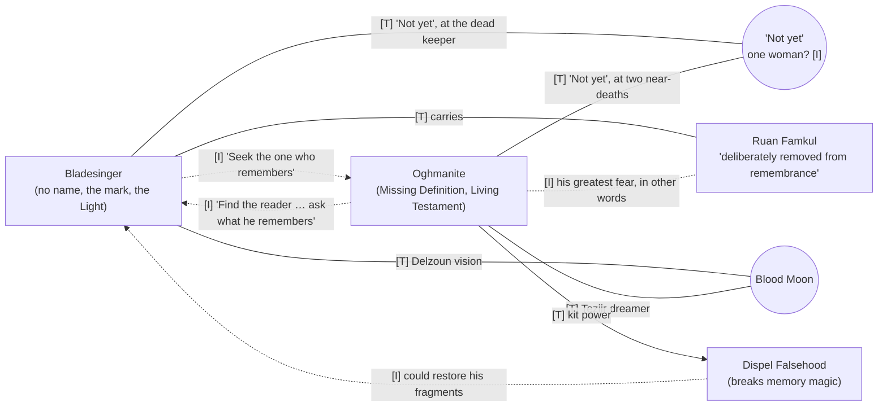
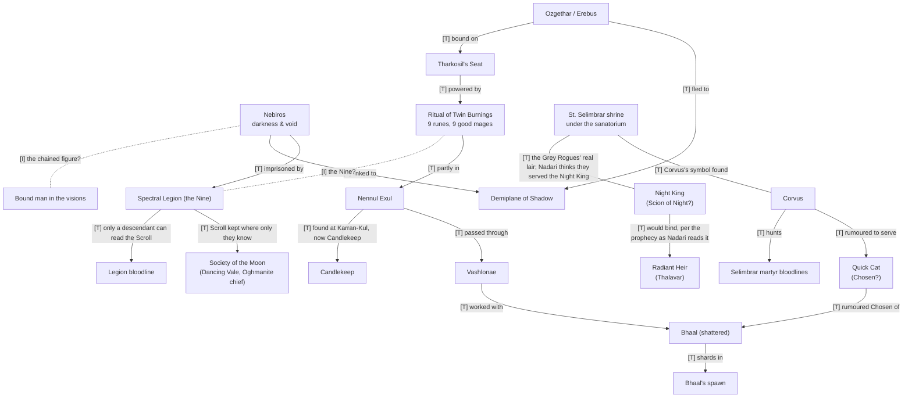

# Campaign web

What is going on, as far as the documents show, around **1160 DR** in Panagiotis's
custom Realms timeline. Built only from the texts listed below. Canon is checked
separately (see `Questions for Panagiotis.md`).

**How to read it.** Every link is tagged.

- **[T]**: the text says it. The source is given, and a quote where it matters.
- **[I]**: my inference. Plausible, not stated. Inferences are for thinking with,
  never for telling Panagiotis what his plot is.
- **[C]**: published Realms canon, only in §14. Reference, not constraint.
- **[P]**: what Christos or Panagiotis has said about our campaign (from 2026-10-08). Treat as fact.

**Sources.**

| Tag | Document | Layer |
|---|---|---|
| ELF | `ELF BACKGROUND - Chris Draft to be finished` | 2026 |
| OGH | `OGHMANITE BACKGROUND` | 2026 |
| KIT | `Custom Kit- The Shield of the Scroll` | 2026 |
| WG | `Westgate ΑΠΟΣΤΟΛΗ - NADARI AND MORE` | 2026 |
| NEN | `Nennul Exule` | 2026 |
| BHA | `Shards of Bhaal story` | 2026 |
| LEG | `SPECTRAL LEGION.docx` (Sylvia's words, sent 2014-07-03) | 2014 |
| HED | `Journal of HEDRACK.docx` (sent 2014-06-25) | 2014 |
| NOTES | `Dunendain/notes.txt` and the seven handwritten pages it transcribes | 2014–15 |
| MAIL | `Email handouts/` (the 2014–2015 emails) | 2014–15 |

---

## 1. The spine: the two characters were written as a pair

The two backgrounds keep answering each other. The quotes in the first two columns
are verbatim [T]; the third column says how strong the link is. Setting two quotes side
by side is [T]; claiming one causes or *is* the other is [I].

| The bladesinger (ELF) | The Oghmanite (OGH) | Link |
|---|---|---|
| "Seek not the place. **Seek the one who remembers.**" (the First Stanza) | "Do not search for the book. The book was never the vessel. … **Find the reader.** … ask him **what he remembers**." (mentor's final note) | [T] both quotes; [I] that each points at the other |
| "Do not ask what the Song means. **Ask what it has forgotten.**" | "When a page is missing, don't only ask what was written on it. **Ask who tore it out.**" | [T] both quotes; [I] the same habit of mind |
| The Light (*Ithil'Vaer*) entered him beneath Myth Drannor: "You are carrying it." | "Seek **the one whom the light remembers** at dusk." | [I] the elf is a candidate for "the one whom the light remembers". So is Lareth, the *Heir of Dusk* (§6). The phrase fits both, possibly on purpose. |
| His mark is "Ruan Famkul": "**That which has been deliberately removed from remembrance**." | His greatest fear: "that something could be **deliberately erased** so completely that nobody even remembers that there was ever anything to search for." | [T] both quotes; [I] that the elf's mark is the Oghmanite's question made flesh |
| He has no name: "Something else had already written itself where your name should have been." | His gift is "the Missing Definition". His dream voice says "**Name it.**" | [I] the one who can't be named, and the one who knows when something is called what it is not |
| The Garden vision: "Then a point. A single point of Light. From it came Song … You saw stars born. You saw worlds begin." | Dream II: "A point of light appears … Everything else is appearing around it." Then a darkness that makes stars "cease" | [T] both dream creation unfolding from a single point of Light; [I] that it's the same Light |
| The Blood Moon: the mark changes, and he sees the Delzoun door | During "the Blood Moon phenomenon" he hears of the Teziir dreamer | [T] both texts name the Blood Moon; [I] the same night |

### "Not yet": the same words in both backgrounds

| ELF, the death of the ancient elf | OGH, two near-deaths (Ardeep Forest; leaving Baldur's Gate) |
|---|---|
| "Tall. Pale. Dark hair. **Something red upon her lips.**" | "An intoxicating perfume (probably a woman's)" |
| "There was blood. Very little. **Far too little…**" | "Blood all around you" |
| "You are late." / "No. Don't." / **"Not yet."** | "A woman's voice, almost singing, saying **«Not yet»**" |
| She hums the three notes; he can only ever recall two | "A strange **red feather**" |
| He raises his sword to kill her and lowers it; he doesn't know why | He comes to, alive, and remembers almost nothing |
| She asks him something; he answers; she says "**Good.**" He doesn't know what he agreed to | Memories of both events are "completely blurred" |
| She touches the Dahast leaf: "Dahast". "No. But I knew **the woman who taught her mother**." | |
| "**An elf does not call another elf.** He leaves something behind that can be remembered." She cuts marks into a leaf | |

- [T] Both texts: a woman's voice saying "Not yet", blood, a moment of death or near
  death, and memories left in fragments.
- [I] **One woman** behind both. Strongly suggested by the details on each side (red
  lips here, a red feather there, perfume, the words), but never stated.
- [I] "An elf does not call another elf. He leaves something behind that can be
  remembered." She states an elven custom and then performs it, which suggests she's an
  elf herself. "I knew the woman who taught her mother" makes her centuries old.
- [I] *Red upon her lips* plus *far too little blood* reads as feeding: Westgate
  has vampires (WG). The *red feather* reads as phoenix: the Legion's Zephon and the
  ancient Virinis (§3). These two readings pull in opposite directions, which is
  probably the point.
- [I] **The memory gaps are themselves evidence.** In both men, something removed
  memory. The Oghmanite's kit power, *Dispel Falsehood*, works "**exclusively**
  against … spells meant to erase/alter memory (like the *Forget* spell)" (KIT). The
  secondary character's signature ability is the tool for the primary's central wound.

---

## 2. Timeline

Dates are DR. "~" means derived by me from a relative date ("six years ago"), taking
the present as 1160.

| When | Event | Source |
|---|---|---|
| −946 to −150 | Narfell; the kingdom of Yhalvia is ruled by the demon **Ozgethar** until mages under **Bagathal Tharkosil** bind him to *Tharkosil's Seat* | NEN [T] |
| −343 / −317 / −286 | Orlak born; becomes a vampire; seizes Westgate as the **Night King** | WG [T] |
| −137 | Dawnknight **Gen Soleilon**, paladin of Lathander, destroys Orlak and is crowned; the Soleilon dynasty lasts to −27 | WG [T] |
| "lost in time" | The **Spectral Legion** (the Nine) imprisons **Nebiros** in an extradimensional prison | LEG [T] |
| final days of Delzoun | Dwarven record: elves "came from the west, though no elf had crossed the passes"; the elf's mark beside it | ELF [T] |
| 101 | **Irildë Velsaran**, half-elf oracle "of Mystran descent", writes the Heir of Dusk prophecy and vanishes | OGH [T] |
| 930, "Year of Doom" | The bladesinger is born in the Forest of Mir; his mother Elyndra Dahast dies | ELF [T] |
| ~940 / ~946 | Wooden sword from Orendyl (age ~10); first bladesong (~16) | ELF [T] |
| before 1152 | **The Long Night**: "for almost two years, Faerûn endured an unnatural darkness." The Garden beneath Myth Drannor; the Light enters him | ELF [T] |
| 1152 → | His years of searching | ELF [T] |
| ? | Thaelith dies; the letter for Khelben; the **Blood Moon** vision | ELF [T] |
| ? | The Song dreams; the First Stanza; the ancient elf found dead; the woman | ELF [T] |
| now | He heads to Waterdeep and Khelben | ELF [T] |
| ? | The Oghmanite's mentor dies, leaving two final messages | OGH [T] |
| ? | First encounter with Corvus; the **Ledger of Grace** (plague village near Tethyr) | OGH [T] |
| ~1154 ("six years ago") | **Asbravn**: Corvus massacres the House of the Suffering God and takes the Kantorius manuscripts | OGH [T] |
| ~1155 or earlier ("5+ years") | Last contact with the mage Jazrac, Orianna's mentor | OGH [T] |
| ? | Birakar and Temag, "the Heroes of Irondagger", recover a treasure at **Karran-Kul** (sent to Candlekeep). The Oghmanite helps catalogue it: **Nennul Exul**, and the Erebus/Ozgethar symbol. A **rain of dead bodies** follows "immediately after" | OGH [T] |
| "a few years ago" | Westgate: the Vhammos caravans, Grey Rogues, the sanatorium, **Jamalin** | WG [T] |
| ~1158 ("about 2 years") | The Oghmanite in Westgate on a Harper mission with Nadari | OGH [T] |
| ~1159 ("about 1 year ago") | **Orianna** is brutally murdered | OGH [T] |
| recent | Nadari's contact goes into the sanatorium and does not return | WG [T] |
| now | The Oghmanite stays in Westgate after the mission. The lair beyond the portal was a shrine of **St. Selimbrar** (Ilmater); Corvus's symbol is there too; "Quick Cat" is rumoured to be Bhaal's Chosen | OGH [T] |
| before the fall of Netheril | Bhaal destroyed by the Simbul's botched imprisonment; red rain over **Elanith**; his spawn carry the shards | BHA [T]; date [P] |
| recently | **Bhaal is resurrected** | [P] |

[I] The Long Night is "when day looked as night", the condition for the Night King's
ritual on "the Night of the Red Eye" (WG). If that reading holds, the Westgate plot's
clock started during the elf's Long Night.

---

## 3. The Nine: the Spectral Legion and Nebiros (2014 → 2026)

**[T] The Oghmanite's Nine carry the same nine names, in the same order, as the
Spectral Legion from your 2014 game.** [I, near-certain] They are the Legion.

| OGH (2026) | LEG (2014) | NOTES (your 2014 handwriting) |
|---|---|---|
| Salendra | Shalendra, elven archmage, "from the place today known as Evereska" | Salendra, Elven Archmage (Evereska) |
| Mistee Addizar | female paladin "blessed by the grace of her Goddess" | Mistee Addisar, Paladin (Torm?) |
| Crafyr | half-elf arcane mage, Thay | Crafyr, Half-Elf Arcane Mage (Thay) |
| Altumil | human mage, Turmish | Altumil, Human Mage (Turmish) |
| Braniver | eladrin, Arborea | Braniver, Eladrin (Arborea) |
| Zephon | **phoenix**, Elysium | Zephon, Phoenix (Elysium) |
| Krivdaar | t'uen-rin, Arcadia | Krivdaar, Tuenavir (Arcadia) |
| Galizur | aasimon deva, Astral | Galizour, Asimon Deva (Astral) |
| Akalim | aasimon solar | Akalim, Asimon Solar |

What the 2014 handout says [T, LEG]:

- **Nebiros**: "pure evil, claiming the portfolio of pure darkness and void", linked
  to **the Negative Plane and the Demiplane of Shadow**. He planned to destroy the
  Negative Energy Plane; the world's balance broke (unchecked growth, healing that
  harmed).
- The Nine sealed him in an **extradimensional prison** by a ritual from an
  **ancient Scroll**. The force of it cursed them to be spectres, hence the name.
- The Scroll is guarded by the Legion "in a place known only to the **Society of the
  Moon**". **The ritual can be reversed.**
- Only a **direct descendant of the Legion** can read the Scroll, through a pair of
  special **glasses** that "were cast to the Planes".

What your 2014 notes add [T, NOTES]: "Sorcerer King → Orbdamus OR Nebiros → Demon →
Greater God → Darkness, link to the Negative Plane". "Society of the Moon → Keepers",
based in **Dancing Vale**, whose people include **Father Crandam Ethander, Chief of
the Oghmanite clergy**, and Renard Redclyff, High Silverstar of Selûne.

What the 2014 Hedrack journal adds [T, HED]: behind the Dark Temple (the Temple of
Elemental Evil, borrowed from Greyhawk) was "the cult of
the Shadow Eye, and behind them, the cult of Nebiros". "The Shadowcasts rule over the
cult, and **the Shards** are the masters of the Shadowcasts." "The First of the
Triad." The Doomdreamers will stand "when **Nebiros once again walked the earth**".

Links:

- [T] The Oghmanite's Dream II: figures "standing between the light and the
  darkness … One. Two. Three. Four. Five. Six—". He counts six of what should be nine.
- [T] **Virinis**, "an ancient phoenix", is tied to "the earliest references to the
  Nine" (OGH). Zephon is the Legion's phoenix (LEG). Whether they're the same bird is
  open.
- [I] The bound figure in the elf's vision ("chains … a black wound … **refusing its
  ending** … He forgot what it means to end"), the Teziir dreamer's "man bound, suffering
  under chains that never break" (OGH), and Nebiros in his sealed prison may all be
  one figure. The elf's voice says "**Do not fear him.**"
- [I] The darkness in the Oghmanite's Dream II "trying to erase the idea of shape
  itself" fits Nebiros's "darkness and void" portfolio.
- [I] **The Society of the Moon has an Oghmanite at its head.** That is a natural
  home for the Oghmanite's unnamed mentor, or for the order that sent him. It is
  also the obvious place to ask about the Nine.
- [I] The Legion's Scroll needs a **descendant** to read it. Salendra was an elven
  archmage of Evereska; Mistee Addizar a paladin. See §8: bloodlines are being hunted.

---

## 4. The Light and the Song: the elf's first mystery

[T, ELF] The pieces:

- ***Ithil'Vaer***, "the First Light", older than moonlight or divine radiance: "the
  first act by which possibility became reality".
- ***Ithil'Vaer en'Lath***, "The Song Before the First Light". Verse 1 is the Song
  before the singer; verse 2, "a star that had no sky"; verse 3, "a Garden where
  beginnings slept". "The Light cannot be summoned. It can only be given room to
  return."
- **The Keepers of First Dawn** (*Vael'Shaerith*), guardians of the memory that
  something existed before the elves. Nearly vanished. **Lethariel Starbough** gave him
  the **white seed**: "When you see the sky without stars, plant this where you find
  the answer."
- **The Garden** beneath Myth Drannor, during the Long Night: white trees, "a sky
  that had no stars", a still pool, **the Seed**. He touched it; he saw creation, the
  Light fracturing, a fragment falling into darkness, chains, a figure. A female voice:
  "Do not fear him. … He forgot what it means to end. … You are not here. … You are
  carrying it." Then the Light entered him.
- Afterwards: dreams of a tall elf with **a sword and a brush**, drawing lines of
  light into empty space. Never the face.
- **The silver leaf** (the Dahast pendant) says on its back: "**When the ember
  remembers itself, follow the Song.**" Thaelith: "If the ember ever wakes again,
  do not search for the Garden. Follow the Song."
- **The three notes**: one from very far away, one from beneath the earth, one from
  within his chest.
- **The First Stanza**, which came to him as memory: "Its first note was given to
  memory. Its second to a living voice. Its third to stone. And the last note waits
  where no living elf remembers it." … "the keeper of a melody no living elf has heard
  for four thousand years."

Links:

- [T] The Garden had "a sky that had no stars", and the seed's instruction names
  that sky. **He kept the seed. He did not plant it there.** (He "carried the white
  seed" when he left.)
- [T] Verse 2, "a star that had no sky", inverts Lethariel's "sky without stars".
- [I] A tall elven figure with **sword and brush** is how Corellon Larethian would
  appear: warfare and the arts. The "crescent shape" that kept appearing to him fits
  Corellon's symbol. The text never names the dream-figure.
- [I] The three notes and Thaelith's three mysteries line up: far away, the stars,
  the Light; within the chest, the heart, his blood and name; beneath the earth, stone,
  the mark and Delzoun. **The note he cannot remember is the third.** In the Stanza,
  the note "given to stone" is also the third.
- [I] "Its second to a living voice": the Song survives partly *in a person*. That is
  exactly the Oghmanite's **Living Testament**: Pylacheus split his knowledge across
  living people so no fire could take it (OGH). Your own Word comment on the
  Oghmanite's epigraph says the same thing: songs outlive lyrics, and "at the end,
  just the tune".

---

## 5. The mark: Ruan Famkul and Delzoun, the elf's second mystery

[T, ELF]:

- A dark symbol on his body since birth. It does not answer *detect magic*, moonlight
  or silver, and isn't an elven rune. Saelith forbade copying it.
- Not in any Dahast record. Thaelith finally found it in a **dwarven** record: ***Ruan
  Famkul***, "That which has been deliberately removed from remembrance", meaning
  forgotten by design rather than destroyed.
- It sits beside passages on **the final days of Delzoun**: "…where the anvils froze
  beneath the mountain…", "…the road into the valley was closed…", "…restore what was
  broken…", and "**They came from the west, though no elf had crossed the passes.**"
- The Blood Moon vision: black mountains under a white sky, a valley ringed by stone,
  **frost-covered anvils**, silent dwarves, **a stone door closing**, the symbol carved
  on the door.
- Thaelith, firmly: **the mark is not the Light.** "They may both have chosen you.
  That does not make them the same."
- "Your mother did not fail to name you. She couldn't. Something else had already
  written itself where your name should have been."

Links:

- [T] The Ozgethar/Erebus symbol (OGH, image) is two crescent shapes. The elf's
  "first signs" include "a crescent shape" that kept appearing. **The text never shows
  the elf's mark**, so whether the two match is unknown.
- [I] **"The road into the valley was closed."** The 2014 Realms party, Birakar's
  among them, last stopped at **Hidden Valley** (MAIL, 2014-08-26). Birakar is a dwarf.
- [I] "Restore what was broken" and "the last note … given to stone" both point
  beneath the mountain.
- [I] A dwarf in the party (Birakar) is the natural door into a dwarven mystery.

---

## 6. Prophecies and fragments, side by side

| Source | Text | Shared motifs |
|---|---|---|
| Westgate, said to a king centuries ago (WG) | "In the twilight of shadow's return, the **Scion of Night** will be revealed at vulgar cost. With burning anger from ages past, he will **bind the Radiant Heir** and **her blood** will render unto him the darkest power." | night, binding, blood, heir |
| Irildë Velsaran, 101 DR (OGH) | "When **the Moon bleeds** and the sky weeps stars, the world shall be cloaked in the final veil. From the blood of the moon shall rise the **Heir of Dusk**, whose breath stills light, and whose eyes drink fate. **Three** shall fall by blade unseen, **three** shall rise with voices unheard, and the shadowed crown shall pass to one who walks between. Beware the Mirror-Tide, when **silver flows to rust**." | blood moon, heir, three, crown, silver |
| "The oath of Elanith" (OGH) | "Blood shall seed the land, and the unworthy will be cast as **rain**. In the village of the forsaken, a new covenant shall be forged in crimson, uniting the living and the dead." | blood, rain |
| "The Last Seer's Dream" (OGH) | "A river of bodies will fall from the heavens, and their cries will awaken what sleeps beneath. **In the shadow of the shards**, mortals will decide the fate of the divine." | rain, shards, what sleeps beneath |
| Mentor's last message (OGH) | "When the Missing Definition begins to define itself, seek **the one whom the light remembers at dusk**." | light, dusk |
| Mentor's final note (OGH) | "Do not search for the book. … Find the reader. Find the one whom the light remembers at dusk. And when you meet him… ask him what he remembers." | memory |
| The First Stanza (ELF) | "Seek not the place. Seek the one who remembers." | memory |

Links:

- [T] A **Blood Moon** happened (ELF, OGH). Irildë: "When the Moon bleeds … From the
  blood of the moon shall rise the Heir of Dusk."
- [I] If that Blood Moon is Irildë's bleeding Moon, her condition is already met.
- [T] Lareth: "Heir of Dusk", "Beautiful", "You will understand when you meet him"
  (OGH).
- [I] Dream III's dark-armoured man, "a dead thing that remembers being alive", who is
  afraid ("Do not remember the name. … Because it remembers you."), could be Lareth.
  Nothing in the text says so.
- [I] **Scion of Night** (Westgate) and **Heir of Dusk** (Irildë) are two titles
  that could belong to one figure or two rival ones.
- [I] "Three shall fall by blade unseen": an assassin's work. Quick Cat is an assassin
  rumoured to be Bhaal's Chosen (OGH). Orianna was "brutally murdered" (OGH).
- [I] "**Silver** flows to rust" next to the **silver** Dahast leaf, and Selûne's
  silver; "Mirror-Tide" next to Pylacheus's suffering as "a **cosmic mirror**" (OGH).

### Lareth and Bagathal: a name thread from 2014 [T, HED; I]

- 2014 Hedrack journal: "I saw no greater servant of evil than the one called
  **Bagathal the Beautiful**. Iuz, Shar, and even Lolth recognized his power. Although
  he died defending the MoatVale, I brought him back from death—albeit disfigured. I
  believe that he still lives in Nulbegor … Perhaps he is now insane."
- Same journal, later: "I now believe that the **Champion** of Elemental Evil is
  **Lareth the Beautiful**", the one in "the Prophecy of the Champion, the one who would
  restore the power of the Temple".
- 2026 (NEN): the archmage who built Tharkosil's Seat is **Bagathal** Tharkosil.
  2026 (OGH): **Lareth**, "Beautiful", Heir of Dusk.
- [I] The 2014 handout has Bagathal and Lareth both called "the Beautiful", in the same
  document. Either they're one person under two names, or the name was changed partway.
  Now one name is on an ancient Narfellian archmage and the other on the Heir of Dusk.

---

## 7. Darkness and binding: Ozgethar, Nennul Exul, Bhaal

[T, NEN]:

- **Nennul Exul**: a minor artifact. Said to be part of the *Book of Vile Darkness* or
  an evil tome by an unknown author. Blood magic; complex rituals. Expanded by a priest
  of **Jergal**; passed through **Orcus** and the demoness **Vashlonae** (daughter of
  **Abraxas**, demon lord of forbidden lore). Linked to the **Vashar**, an ancient race
  "as the drow are to elves", but human.
- It holds part of the **Ritual of Twin Burnings**: sacrifice a **good human mage** at
  the full moon, once a month, near **Tharkosil's Seat**, with a sacrificial knife and
  "words of dark terror". The victim is destroyed body and soul, and a **rune of chaos**
  forms. **Nine** rituals make a nine-sided crystal pyramid and permanently bind whoever
  sits on the Seat.
- The Seat suppresses all divination within **300 km** while active.
- History: Yhalvia (Narfell) was ruled by the demon **Ozgethar**; rebel mages under
  **Bagathal Tharkosil** built the Seat, used the ritual, bound him, and then ruled and
  rotted. A celestial, **Artaxus**, overthrew them. Ozgethar fled to the Planes, most
  likely the **Demiplane of Shadow**. The Seat vanished, thought destroyed.
- Ways to destroy the Seat: a weapon made or blessed by a greater deity; the great
  forge of the balor prince **Verr'maal** in the Abyss; or 100 mages for 100 days.
- **Demoncysts**: Narfell's demon-prisons, sealed with the spell **Drith**. A few
  may survive "in the wider area of the Dales".

[T, OGH]: the Oghmanite saw Nennul Exul and **the Erebus/Ozgethar symbol** at
Karran-Kul (Irondagger) while cataloguing Birakar and Temag's finds. "Notes of Naquent
and others (from Karran-Kul findings)" mention the ritual (NEN).

[T, BHA]: Bhaal, in human form, studied in Sword Coast libraries and worked with
**Vash'lon'ae** (the same demoness) on "the forces that could elevate the ritualistic
process of murder". Betrayed by **Andella**, posing as the Simbul's adviser. The
Simbul's imprisonment failed in a wild-magic zone north of Amn. Bhaal hurled his
essence north as **shards**, and red rain fell on **Elanith**, south of Luskan. The
shards are undetectable except by Bhaal's Chosen at close range; there are six types.
The Simbul's council decided to destroy all of Bhaal's spawn.

Links:

- [T] The same name and parentage, **Vashlonae** / **Vash'lon'ae**, "daughter of
  Abraxas", appear in both NEN and BHA.
- [I] That makes her the link between the tome and Bhaal.
- [T] The rain of bodies followed the Karran-Kul expedition "immediately", and the
  Oghmanite ties it to Bhaal through "the oath of Elanith" (OGH). BHA has red rain
  falling on Elanith when Bhaal shattered.
- [I] One event, seen from two sides.
- [P] Bhaal has recently come back. [I] The Oghmanite's reading of "The Last Seer's
  Dream", that Birakar's and Temag's actions at Karran-Kul "directly influenced Bhaal's
  return—or the prevention of it" (OGH), now has an answer: return.
- [T] **Nebiros** (2014) and **Ozgethar/Erebus** (2026) are both tied to **the
  Demiplane of Shadow**.
- [I] **Nine** runes of chaos from **nine** good mages; **nine** candles snuffed in
  the Teziir dream ("nine is sacred in Bhaal's lore", OGH); **the Nine** of the Legion.
  The Legion "sacrificed themselves for some purpose that has since been forgotten" is
  one of the readings the Oghmanite found (OGH).
- [I] A ritual that destroys its victims *body and soul* would leave nothing of them
  but fragmentary names: the Oghmanite's description of the Nine.
- [I] Divination is blocked for 300 km around an active Seat. That would explain why
  nobody can simply *divine* any of this.
- [I] "Shards": the masters of the Shadowcasts (HED, 2014) and the shards of Bhaal
  (BHA, 2026). The same word in two hierarchies.

---

## 8. Bloodlines: everyone is hunting a lineage

| Lineage | Who wants it | Source |
|---|---|---|
| Descendants of the **Spectral Legion**, the only ones who can read the Scroll that unseals Nebiros | unknown | LEG [T] |
| The **Radiant Heir**, Gen Soleilon's blood, traced to House **Thalavar** | the Night King: "bind the Radiant Heir … her blood" | WG [T] |
| The martyrs of **St. Selimbrar** in the **Ledger of Grace** | **Corvus**: a hit list, and a Bhaalist ritual | OGH [T] |
| **House Dahast**, of which the bladesinger is the last | unknown. The woman knew "the woman who taught her mother" | ELF [T] |
| **Bhaal's spawn**, who carry shards in their souls | the Simbul's council, and anyone after the shards | BHA [T] |

- [T] **Orianna** was not Nadari's blood sister: she was adopted, and "related to the
  noble family Thalavar" (WG). She was the Oghmanite's Harper contact and was
  "brutally murdered" about a year ago (OGH). In 2014 she was Anthie's player
  character (NOTES).
- [I] Orianna may have carried Soleilon blood. The prophecy says "**her** blood".
- [I] Corvus kills bloodlines; the Night King binds one; the Scroll needs one. Three
  plots that each turn on who is descended from whom.

---

## 9. Westgate: the Night King thread

[T, WG] Nadari ("Dari"), in her own words to Birakar and "dear **Theodmund**":

1. A few years ago the Vhammos caravans were attacked for months. The Harpers took
   it on. The attackers were **Grey Rogues**, Thayan mercenaries paid by "**Thandie**".
2. Their base was an abandoned **sanatorium** east of the city near the river, with
   **vampire spawn** inside, and an underground complex leading to a hidden base far
   below. They closed it. They lost **Ghost**, killed their leader **Alerra**,
   captured two, and one escaped. Alerra's journal named who paid.
3. "Thandie" was not Lady **Thistle Thalavar** but her partner **Jamalin**, turned
   vampire and impersonating her. Jamalin was killed on the second attempt. Their
   companion **Moira** identified the twin-bladed dagger that flew off from Thalavar
   castle that night: the **Flying Fangs**, regalia of the **Night King**.
4. The prophecy (§6). The Radiant Heir's line ends in House Thalavar. The ritual needs
   "when day looked as night", the **Night of the Red Eye**.
5. Nadari now thinks Jamalin was a tool of the Night King or someone close to him,
   because she only ever hit Vhammos, Thalavar's chief rival, to weaken Thalavar and
   reach its blood. "We left something unfinished in the sanatorium."
6. Recently her contact went to the sanatorium and didn't return. "The portal, the
   base below" may still be in use.

[T, OGH]: the Oghmanite found that the lair beyond the portal was an ancient shrine of
**Ilmater**, dedicated to **St. Selimbrar**. **Corvus's symbol** was there.

Links:

- [T] **St. Selimbrar appears three times.** He is the saint Pylacheus followed. The
  Ledger of Grace records the bloodlines of his martyrs, which Corvus hunts. And the
  shrine under the Westgate sanatorium is his (all OGH).
- [I] That makes him the knot between the Oghmanite's thread and Westgate's.
- [T] Gen Soleilon was a paladin of **Lathander**. Your old party had a Lathanderite,
  **Connel Avison** (Alexis), and knew **Mattela Ordeil**, High Priestess of Lathander
  (NOTES).
- [T] NOTES lists **Hygraath Crom**, "the itinerant priest, Savior of Westgate". There is
  no other mention.
- [I] The **Argraal** (the chalice) is the Fangs' twin regalia (WG). Nobody says where
  it is.

---

## 10. The Pylacheus, Corvus and Bhaal thread: the Oghmanite's own

[T, OGH]:

- **Pylacheus**, an Ilmatari scholar who followed St. Selimbrar, branded a heretic.
  The mentor's evidence: he wasn't one. He let himself be remembered as dangerous,
  scattered and destroyed his own work, and handed pieces to living people: **the
  Living Testament**.
- **Egen Kantorius**, a high scribe, recorded Pylacheus's suppressed teaching:
  suffering as "**a cosmic mirror**" that reveals "the futility of gods who define
  themselves through violence", naming Bhaal.
- **The Redactors** forge, remove and burn history. Among their most targeted records
  are "**accounts of ancient elven magical catastrophes and blights**". Their rise
  caused the Children's **Schism of Secrets** and the founding of the Shields.
- **Corvus the Redactor**: a thief who fights like a predator, dark magic, a jagged
  sacrificial dagger. Burned the Ledger's final index in a Bhaalist rite (Tethyr) and
  slaughtered Asbravn's acolytes for the Kantorius texts. His symbol is a skull, a
  dagger and curved horns (OGH, image).
- The blood message at Asbravn: "Kantorius knew… bind the Blood-Lord's shadow… seeks
  the source text… forbidden tome of Bhaalist heresy was smuggled away from the
  vaults… hidden… Ilmatari monk… before the ink is turned to blood."
- "Someone was feeding him clues." And: "someone else had been investigating **you**."
- Now: Corvus is said to serve **Quick Cat**, an assassin rumoured to be **Bhaal's
  Chosen** "after his ascension" (μετά την ανέλιξή του).
- [P] Bhaal **is back**, recently resurrected. So "his ascension" is most likely
  Bhaal's return, and Quick Cat is a Chosen of the risen god.

Links:

- [I] **The Redactors target elven catastrophe records, and the elf's whole life is a
  missing record.** His mark isn't in the Dahast books; the Keepers of First Dawn nearly
  vanished; the ancient keeper of the melody was killed. Someone removing elven history
  would want both of these characters.
- [I] "Bind the Blood-Lord's shadow" uses the same verb, *bind*, as Tharkosil's Seat
  and the Night King's prophecy.
- [I] "The source text … forbidden tome" and Nennul Exul, the blood-magic book now in
  Candlekeep.
- [I] Bhaal is shattered; his shards sit in his spawn; Corvus hunts bloodlines with
  Bhaalist rites; Pylacheus wrote about Bhaal's futility. The "Ilmatari monk" may be a
  Living Testament carrier.

---

## 11. People

| Name | What we know | Source |
|---|---|---|
| **Nadari ("Dari")** | Harper in Westgate's underworld for years. Orianna's adoptive sister. Calls the Oghmanite "Theodmund" | WG, OGH |
| **Orianna** | Harper, the Oghmanite's main contact, murdered ~1159. Adopted; Thalavar connection. Mentored by Jazrac. Anthie's 2014 PC | OGH, WG, NOTES |
| **Jazrac** | Mage, Orianna's mentor, "possibly a coded name". Out of contact 5+ years | OGH |
| **"Saturn"** | The Oghmanite's current main Harper contact | OGH |
| **Birakar** | Dwarf (Savvas). With Temag, a "Hero of Irondagger". Heard Nadari's account | NOTES, OGH, WG |
| **Temag** | Birakar's partner at Karran-Kul. Unknown to us | OGH |
| **Moira** | Nadari's companion who identified the Flying Fangs | WG |
| **Ghost** | Killed under the sanatorium | WG |
| **Thaelith Moonwhisper** | Scholar-mage, the elf's second teacher. Found Ruan Famkul. Sealed the letter to Khelben. Dead | ELF |
| **Orendyl Greenleaf** | Old bladesinger, the elf's first teacher | ELF |
| **Saelith Moonbrook** | The elder who first held him and said "Then he has no name." Forbade copying the mark | ELF |
| **Lethariel Starbough** | One of the last Keepers of First Dawn; gave the white seed. The community is called "Lethariel's Refuge" after him | ELF |
| **Elyndra Dahast** | His mother, a scholar of what survives its civilisation. Died at his birth | ELF |
| **The woman** | §1 | ELF, OGH |
| **The ancient elf** | Keeper of a 4,000-year-old melody. Found dead at his desk, a book under his hand | ELF |
| **The Oghmanite's mentor** | Unnamed Oghmanite archivist. Coined "the Living Testament". Suspected the Oghmanite is part of it. Dead | OGH |
| **Father Crandam Ethander** | Chief of the Oghmanite clergy in Dancing Vale (Society of the Moon) | NOTES |
| **Corvus**, **Quick Cat** | §10 | OGH |
| **Dorigen Tellar** | Talona cultist; the Ardeep Forest near-death | OGH |
| **Naquent** | Whose notes on the Karran-Kul finds mention the ritual | NEN |
| **Sylvia** | Priestess of Mystra (Iron Dagger), source of the 2014 Legion, Mir and Sigil briefings | NOTES, LEG |
| **Estavan** | Merchant lord of the Planar Trade Consortium (Sigil). Your 2015 last position was on the way to talk with him | NOTES, MAIL |

---

## 12. Recurring motifs

- **Nine**: the Legion; the runes of chaos; the Teziir candles; Bhaal's sacred number.
- **Three**: the notes; Thaelith's three mysteries; the elf's "three paths"; "three
  shall fall … three shall rise"; "the First of the Triad" (HED).
- **The moon**: the Blood Moon; the Society of the Moon; Selûne; "the Moon bleeds";
  "the blood of the moon"; the Twin Burnings need the full moon.
- **Silver**: the Dahast leaf; silver trees in the woman fragment; "silver flows to rust".
- **Rain**: red rain at Elanith; the rain of bodies; rain in the woman fragment.
- **Erasure against memory**: Ruan Famkul; the Redactors; the Living Testament; the
  white book with its ink removed (Dream I); "If no one remembers it, was it ever true?"
- **Binding**: Nebiros's prison; Ozgethar on the Seat; "bind the Radiant Heir"; "bind
  the Blood-Lord's shadow"; the chained figure.
- **Names**: the nameless elf; the Missing Definition; "Name it"; "Do not remember
  the name… it remembers you"; the Ledger's names; the Nine surviving only as names.

---

## 13. Mind maps

### The spine

### The darkness web

---

## 14. Canon backdrop: the published Realms around 1160 DR

Panagiotis runs a custom timeline, so this is reference, not constraint. **We play 2e: mechanics
always come from 2e books.** Lore from later editions is used where it's good, and
labelled: *Grand History of the Realms* (GHotR), *Champions of Ruin* and FRCS 3e are
3e/3.5e, and so is the *Book of Vile Darkness* cited here. Tagged **[C]**,
with sources: *Grand History of the Realms* (GHotR), *Cormanthyr*, *Lands of Intrigue:
Tethyr* (LoI-T), *Forgotten Realms Adventures* (FRA), *Spellbound*, *Champions of
Ruin*.

- [C] **1160 DR is the Year of the Swimming Lass.** 930 is the Year of the Liberty
  Crest; **714, when Myth Drannor fell, is the Year of Doom** (GHotR p. 99).
- [C] **Khelben Arunsun** has lived in Waterdeep since **1150**, in **Arunsun Tower**
  (renamed Blackstaff Tower only in 1322), and stays until 1256 (GHotR pp. 122, 128). He
  was born in 414 and left Myth Drannor in 449. Waterdeep's ruler is **Ahghairon**, the
  first Lord. Around 1150 a great plague swept the Sword Coast and **Skullport** was
  founded under the city (GHotR p. 121).
- [C] **Westgate** in 1160 is a kingdom under the usurper **Alzurth "the Dozenking"**,
  a former Mage Royal. In **1162** the exiled King Roadaeron retakes the throne and dies
  the same year, and Blaervaer "the Reluctant" follows (GHotR p. 86). Two changes of
  crown in one year. [I] "The shadowed crown shall pass to one who walks between"
  (Irildë) has a calendar to land on.
- [C] Orlak's vampire spawn kept choosing new **Night Kings** in Westgate's underworld
  "into the 14th century" (FRCS 3e p. 144). The title never stayed dead.
- [C] **Vhammos** and **Thalavar** are canon Westgate merchant-noble families (FRA
  p. 116). **Thalavar's symbol is a green feather**; Vhammos's a steel-grey open hand.
  [I] Feathers again: the red feather at the Oghmanite's near-deaths.
- [C] **Khelben was himself nameless.** Born in Myth Drannor in 414 DR to the half-elf
  noble Arun Maerdrym, he was "by elven custom … left unnamed" (GHotR p. 73). He left in
  449 calling himself "Arun's Son", fought at Silversgate in 712 as **the Nameless
  Chosen**, nearly died, and was named Khelben Arunsun in Silverymoon. He kept the scars
  and the silver-white hair as reminders of his hubris (*The Fall of Myth Drannor*
  pp. 27–28). [I] Thaelith sends a nameless elf to the one man who was once nameless too.
- [C] **The Weeping War** began on the Feast of the Moon, 711 DR, and ended with the Final
  Flight on 20 Flamerule **714** (the Year of Doom). Only 200 of 3,000 defenders escaped.
  The mythal was corrupted but not destroyed; its remnant still **dampens forest fires**
  in the ruins (*Ruins of Myth Drannor* p. 27). Canon has no fire there between 715 and
  ~1000. [I] So "the burning city" of 930 would be something the mythal failed to stop.
- [C] **The Trio Nefarious** (*Khov'Anilessa*) were three greater nycaloths: **Aulmpiter**
  the strategist, **Gaulguth** the berserker (axe *Heartcleaver*) and **Malimshaer** the
  one-eyed spymaster. A Netherese archwizard, Aldlas Sodhese, first summoned them around
  −1200 DR while hunting the Nether Scrolls. The elves sealed them in a pocket prison above
  the city; they escaped in 708, raised the Army of Darkness (about 60,000) and led it. In
  canon **all three died in the war** (713–714). [P] They are "a thing" in our campaign.
- [C] **Netheril** fell in **−339 DR**, the Year of Sundered Webs: Karsus cast the only
  12th-level spell ever made to steal Mystryl's power, and she died to save the Weave
  and was reborn as **Mystra**. [P] In our timeline Bhaal died before that.
- [C] **House Dahast**: gold elves, arms a lap harp and a dagger, nearly extinct, last
  named members Purtham and Lhoris (*Cormanthyr* pp. 72, 112–113). Alea Dahast died in
  714.
- [C] **"Sarenestar"**: the Tethir elves' name for the Forest of Mir, possibly for "the
  elves who once dwelt there" (LoI-T p. 53). Hidden in Mir: **Myth Dyraalis** (p. 91).
- [C] **Yhalvia, Thakorsil's Seat and the ritual of twin burnings are canon**. The
  bound being there is the **devil lord Orlex**, and the binder **Thakorsil**
  (*Spellbound* pp. 107–108). Panagiotis's version swaps in the demon **Ozgethar** and
  **Bagathal** Tharkosil.
- [C] **Demoncysts are canon**: pockets of the demon lord Eltab's hidden Abyssal layer,
  bound to Toril around −160 DR, later used by Nar demonbinders to seal fiends (*Champions
  of Ruin* pp. 130–131).
- [C] **Delzoun** fell in −100 DR. No elves are recorded at its end, and no frozen forge.
- [C] **Bhaal** dies in 1358 in canon (Cyric, Boareskyr Bridge). **The Simbul** only
  takes Aglarond's throne in 1320. Both are long after 1160 in canon.
- [C] **St. Selimbrar** is not a canon saint of Ilmater. **Asbravn** and its **House of
  the Suffering God** are canon (*Volo's Guide to the Sword Coast*). **Jazrac** is a
  canon Harper mage of Saerloon, c. 1366.

---

## 15. What Panagiotis adapted: his sources, decoded

**[C]** Panagiotis builds from published material and swaps names. Knowing the
original shows the shape of a thread without spoiling where he's taking it. Sources:
*Return to the Temple of Elemental Evil* (RttToEE) pp. 189–190, *Book of Vile
Darkness* 3e (BoVD) p. 12, *Spellbound* pp. 107–108, *Dungeon* #4, *Uncaged: Faces of
Sigil*, *Empires of the Sands*, *Cloak & Dagger*, the FR wiki.

| In our campaign | The original | Notes |
|---|---|---|
| **Nebiros**, the dark power the Nine imprisoned | **Tharizdun**, the Chained God, sealed in a demiplane by the gods (RttToEE) | The 2014 Hedrack journal is RttToEE's handout with names swapped. [I] The chained figure in the elf's vision, and the Teziir dreamer's "man bound … under chains that never break", fit the Chained God |
| Shadow Eye, Shadowcasts, the Shards, the First of the Triad | Elder Elemental Eye, Doomdreamers, the Triad | "Shards" was the cult's ruling rank in 2014; in 2026 it's Bhaal's soul. Same word, two meanings |
| **Bagathal the Beautiful** (2014), then **Lareth "Beautiful"**, Heir of Dusk (2026) | **Lareth the Beautiful**, RttToEE's prophesied Champion of Elemental Evil | In 2014 Panagiotis renamed Lareth at the first mention and kept "Lareth" at the second. In 2026 "Bagathal" went to the Seat's archmage, and "Lareth" came back with a new title |
| MoatVale, Nulbegor, Dark Temple | Moathouse, Nulb, Temple of Elemental Evil | |
| **Nennul Exul** | The **Book of Vile Darkness**: a Vasharan spellcaster's text, expanded by a cleric of **Nerull**, bound in flesh and demon bone, kept by **Baalzebul**, six copies plus fakes (BoVD) | Nerull → **Jergal**; Baalzebul → **Orcus** and **Vash'lon'ae**; Vecna dropped |
| **Ozgethar / Erebus**, demon of Yhalvia | **Orlex**, devil lord of Yhalvia (*Spellbound*) | Recast as a demon and sent to the Demiplane of Shadow |
| **Bagathal Tharkosil**, Artaxus, Verr'maal | **Thakorsil**; the unnamed "others" who overthrew the council; the balor prince **Vrr'maal** | The ritual details (runes of chaos, "words of dark terror", 50,000 gp, full moon, nine runes) are canon. Canon damps divination around central Thay; ours, 300 km around the Seat |
| **Abraxas**, "demon lord of forbidden lore" | Canon demon lord of magic words and arcane secrets (Abyss layer 17) | His daughter Vash'lon'ae is Panagiotis's |
| The **Night King** binding the **Radiant Heir**'s blood | **Orbakh** (Orlak II), a vampire clone of Manshoon who took the Night King's regalia and planned to **wed the last of Westgate's royal line** (*Cloak & Dagger*) | [I] The prophecy echoes that plan. **Jamalin**, a noble's partner turned vampire as the Night King's tool, echoes **Dahlia Vhammos**, a Vhammos noble and secret Sharran priestess turned vampire Night Master |
| **Dagger Rock** and its people (Grog, Sidon Bearclaw, Yuri Kineron …) | *Trouble at Grog's*, *Dungeon* #4 (1987). Yuri is the villain there | The 2014 map PDF is the module's p. 50 map. Father Veril became Father Lantor of Ilmater |
| **Dancing Vale**, home of the Society of the Moon | The **Dancing Place**: a hidden valley near High Castle in High Dale, kept by clerics of Mielikki, Mystra, **Oghma**, Selûne and Silvanus | [I] Almost certainly also the "**Hidden Valley**" where the 2014 party stopped. The Society's Oghmanite and Selûnite clergy fit the canon keepers |
| **Estavan**, the Planar Trade Consortium | Canon: an ogre-mage merchant lord and Guvner, Clerk's Ward (*Uncaged*) | The **Armory** the 2015 party wanted is the **Doomguard** headquarters. The **Shatter Temple** is Aoskar's Shattered Temple, now the Athar's |
| The Forest of Mir's 80,000 "elves" (2014 handout) | *Empires of the Sands*: 80,000 **drow**, a King of the **Drow**, "North Mir belongs to the drow" | Panagiotis changed "drow" to "elves". It matters for an elf raised in Mir (Questions) |
| The **Spectral Legion**'s kinds | All correctly paired: t'uen-rin of Arcadia, eladrin of Arborea, the phoenix of Elysium, aasimon deva and solar | Galizur (an alias of the angel Raziel) and Zephon (a cherub in *Paradise Lost*) are real-world angel names |

Coincidences, probably not sources: **Corvus Nightfeather**, a kenku assassin and spy
based in **Tethyr** (novel *Sandstorm*), where our Corvus first surfaces; **Shalendra**
Floshin, a sun elf of Daggerford; **"the Nine"**, Laeral Silverhand's old adventuring
band. "Lady of All Stars" (your 2014 notes, for Mystra) is not a canon title, and
"Long Night" in canon is an unrelated Vilhon Reach festival.

---

## 16. New since Panagiotis's 2026-10-09 mail

All [P]. Full digest: `Email handouts/2026 (Panagiotis)/INDEX.md`.

- **Myth Drannor, the Trio Nefarious and Netheril follow canon.** The elf's mother fled
  Myth Drannor **at its fall in 714**; the Mir elves saved her; she bore him in **930**
  and died. "Year of Doom" points at 714, not his birth.
- **The mark** (his image): two horn-like crescents arching over a central drop. [I] The
  same family of shapes as the Ozgethar/Erebus symbol (two crescents) and the "crescent
  shape" of the elf's first signs. Thaelith insisted the mark is not the Light.
- **Rathael, the Moon Between Blades:** the Dahast sword, which recognises only Dahast
  blood. Its guard: **oak leaves around a crescent moon**. **Six runes form six stanzas.**
  The last, **the Rune of the White Tree**, gave a vision: the blade must "drink the
  unfallen tear of **Sehanine's Daughter**" at the moment the autumn wind "breathes upon
  the **silver-leaf root**". [I] White trees (the Garden), the silver leaf (his mother's
  pendant), six stanzas (the Song has stanzas; we've seen only the first).
- **The Seat of Lore, Berdusk:** the Oghmanite's home. Bransuldyn Mirrortor, an old
  gnome master of disguise, is High Loremaster. The **Shielding Hand**, the Children's
  secret discipline, has **eight living Shields**. The Oghmanite's mentor is **a gnome**.
- **Bhaal's return is common knowledge;** the night it happened shook the world. The shards
  story is known in religious circles and to the Harpers. The rain of bodies after
  Karran-Kul is widely known as an omen; **Elanith's red rain is a different, ancient
  event.**
- **The expedition's leader** was the only other survivor, and knows the elf came back
  changed.
- **The Dancing Place is the Society of the Moon's valley**, and the 2014 party's Hidden
  Valley.

---

## 16. What nobody has told us yet

These feed the questions file. Each one is phrased as a gap, not a guess.

1. What the elf's mark looks like.
2. Where the Oghmanite's family is (Panagiotis: "θα βρω τι θα βάλουμε για οικογένεια").
3. Who the Oghmanite's mentor was (Panagiotis: "θα σου πω ποιος").
4. Whether the Oghmanite knows the Nine *are* the Legion, or only has the names.
5. What happened to the cut leaf the woman made.
6. Whether the white seed is still unplanted.
7. What the elf agreed to.
8. Whose "ascension" Quick Cat followed.
9. What Temag is.
10. How Khelben fits 1160, and what Thaelith wanted from him.
11. When the Long Night and the Blood Moon happened, in DR.
